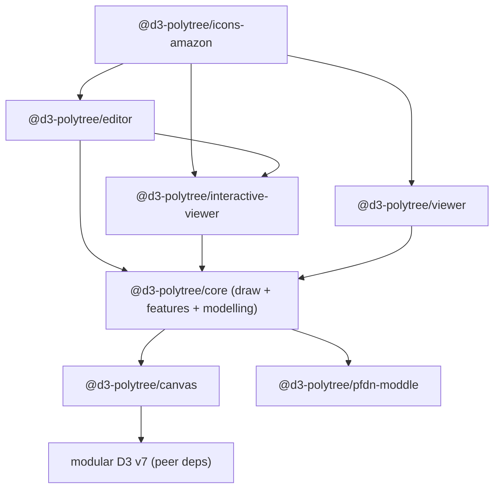

# d3-polytree — Modernization Roadmap

> **Status:** Proposal / RFC · **Owner:** @davcs86 · **Last updated:** 2026-09-18
> **Strategy:** Hybrid, phased-to-consolidation · **Language target:** TypeScript
> **Distribution:** monorepo → scoped npm packages · **D3:** slim, modular peer dependency
> **Dev/docs harness:** Storybook

This document is the single source of truth for modernizing the `d3-polytree` **ecosystem**. It
captures a full audit of the shipping code and the existing `v2.0-beta` prototype, inventories the
constellation of first-party repositories that make up v2, defines the target monorepo
architecture, and sequences the work into milestones with explicit exit criteria. It is
intentionally opinionated to minimize rework; decisions are recorded inline and in the decisions
log (§8), each tagged with the phase it unblocks.

---

## 1. Executive summary

`d3-polytree` renders interactive [polytree](https://en.wikipedia.org/wiki/Polytree) / process-flow
diagrams on top of D3. There are effectively **two codebases** today:

- **`master` (v1)** — a single ~839-LOC `SimpleNetwork` class on a **fully end-of-life stack**
  (D3 v3, Grunt/Browserify, JSHint, Bootstrap 3) with a browser-bundled Node XML parser that
  **requires hand-patching `node_modules` on every install**, a **latent Linux-only build break**,
  zero tests, and no CI. This is what npm/bower consumers get today.
- **`v2.0-beta` + companion repos** — a far more advanced, **diagram-js/bpmn-js-derived**
  rewrite: modular D3 (v1-era submodules), a `didi` dependency-injection kernel, a `moddle`-based
  model layer (`pfdn-moddle`) with an XML file format (`.pfdn`), a feature-module architecture
  (`lib/draw/*`, `lib/features/*`), and **three shipping components — Viewer, Interactive Viewer,
  and Editor**. Its logic is sound and modern _in shape_; only its **toolchain is frozen at mid-2017**
  (webpack 3, rollup 0.45, node-sass 4, ESLint 3/4) and it is **fragmented across eight
  repositories** wired together by `github:` dependencies.

The chosen direction is **hybrid, phased-to-consolidation**:

- **Track A — Stabilize `v1.x`:** make the _shipping_ `master` code correct, buildable, and
  reproducible **without changing its public API**, so current consumers are unblocked.
- **Track B — Consolidate & modernize v2 into a monorepo:** unify the eight first-party repos into
  **one workspace** published as **scoped npm packages** (`@d3-polytree/*`), migrate the frozen
  toolchain to a modern one (Vite/tsup + pnpm + Turborepo + Changesets), convert to **TypeScript**,
  upgrade modular **D3 v1 → v7** as slim **peer** dependencies, retire the jQuery-era stack in the
  properties panel, and stand up **Storybook** as the development harness, visual-regression net,
  and published documentation site.

- **Track D — Host-app integrations:** put the diagrams where process documentation is actually
  written. A single Google Workspace Add-on serving **Docs, Slides, and Drive**, built on a
  host-agnostic embed contract so the next host (Notion, Confluence, Office) is a new adapter
  rather than a new integration. Post-consolidation; gated on C-series prerequisites. Spec in §13.
  _(The letter follows the C-series backlog — there is no Track C.)_

Track B is **consolidation, not a from-scratch rewrite** — the v2 architecture already exists and
is the asset being modernized. This materially lowers risk versus the greenfield framing.

> **Status — B3 engine consolidation complete.** The `v2.0-beta` engine (staged as the
> `@d3-polytree/core-v2beta` import) has been fully carved into TypeScript packages and that
> staging package is now **retired**:
>
> - **`@d3-polytree/canvas`** — the base canvas/registry/exporting layer (de-duplicated with `d3-canvas`).
> - **`@d3-polytree/pfdn-moddle`** — the `.pfdn` moddle model + XML reader/writer.
> - **`@d3-polytree/core`** — the full engine: the `draw` layer (nodes/links/labels/zones, icons,
>   markers, defs, registries), the `model` provider (with settings normalisation), the `modelling`
>   layer (four element handlers + orchestrator), and **every `features/*` module** — pan/zoom,
>   grid/axes, background, mouse events, selection, outline, drag, export, localStorage, upload, the
>   palette (toolbar + add-handlers + link tool), resize, alert icons, tooltip, notifications — each
>   ported to slim modular **D3 v7** peers, off the removed `d3.event` global and legacy
>   `min-dom`/`lodash`/`q`/`xml2js`/`d3-tip` deps.
> - **`@d3-polytree/viewer` / `interactive-viewer` / `editor`** — compose those modules (in the
>   correct boot order) into working components that render and edit a `.pfdn` document end-to-end.
>
> Remaining Track B work is the companion **panels** (search-panel, side-tabs, properties-panel —
> B6 de-jQuery) and the cross-cutting toolchain/CI/Storybook/distribution items below.

---

## 2. Ecosystem inventory

Eight first-party repositories make up the v2 system (all companion repos last pushed 2017). The
monorepo's job is to absorb them.

| Repo                              | Role in v2                                                                                       | Current stack / notable deps                                                                     | Disposition                                                                                               |
| --------------------------------- | ------------------------------------------------------------------------------------------------ | ------------------------------------------------------------------------------------------------ | --------------------------------------------------------------------------------------------------------- |
| **`d3-polytree`** `@master`       | v1 legacy viewer (shipping)                                                                      | D3 v3, Grunt, JSHint                                                                             | Maintain as `v1.x` (Track A); source of the v1 API contract                                               |
| **`d3-polytree`** `@v2.0-beta`    | v2 core: Viewer / InteractiveViewer / Editor, base canvas, `draw/*`, `features/*`, `modelling/*` | modular D3 v1, `didi`, `moddle`, `min-dom`, webpack 3, rollup 0.45                               | Becomes `@d3-polytree/{core,viewer,interactive-viewer,editor}`                                            |
| **`d3-canvas`**                   | Base SVG canvas toolbox: `Canvas`, `ElementRegistry`, `ElementBuilder`, `SvgExportingUtils`      | modular D3 v1, `didi`, `eventemitter3`, `ids`                                                    | **Already vendored** into v2 `lib/base/core/*`; promote to `@d3-polytree/canvas` (single source of truth) |
| **`pfdn-moddle`**                 | PFDN model descriptor — read/write `.pfdn` diagram XML                                           | `moddle`, `moddle-xml`; **has a mocha/chai test suite**                                          | `@d3-polytree/pfdn-moddle` (keep as the file-format package)                                              |
| **`d3-polytree-searchpanel`**     | Search panel feature                                                                             | `list.js`, `min-dom`, webpack 1                                                                  | `@d3-polytree/search-panel`                                                                               |
| **`d3-polytree-sidetabs`**        | Side-tabs UI feature                                                                             | `min-dom`, `domify`, webpack 1                                                                   | `@d3-polytree/side-tabs`                                                                                  |
| **`d3-polytree-propertiespanel`** | Editor properties/editing panel                                                                  | **`jquery` 1.11, `jquery-ui`, `slickgrid`, `spectrum-colorpicker`, `choices.js`, `scroll-tabs`** | `@d3-polytree/properties-panel` — **heaviest modernization liability** (see §7.5)                         |
| **`scroll-tabs`** (fork)          | Tab-scrolling component used by properties-panel                                                 | `min-dom`, karma/phantomjs tests                                                                 | Absorb into `properties-panel`, or publish as `@d3-polytree/scroll-tabs`                                  |
| **`d3-polytree-amazon`**          | AWS icon pack (~300 SVGs) + custom bundle example                                                | depends on `d3-polytree#v2.0-beta` + `d3-canvas`, `svg-inline-loader`                            | `@d3-polytree/icons-amazon` — template for an **icon-pack package convention**                            |

### 2.1 First-party dependency graph (v2)



### 2.2 Architectural lineage

The v2 design is derived from the **bpmn.io / diagram-js** ecosystem (confirmed by @davcs86's forks
of `diagram-js`, `bpmn-js`, `bpmn-js-properties-panel`). The `didi` (DI) + `moddle` (model) +
`min-dom` + `ids` + `eventemitter3` stack, the feature-module pattern, and the palette/handlers
structure are all diagram-js idioms. **This is an advantage:** those patterns are well-proven, still
maintained upstream, and their modern TypeScript equivalents (current `diagram-js`, `didi`, `moddle`)
give us a migration reference and a supported dependency path.

---

## 3. Current-state audit

### 3.1 `master` (v1) — findings

Severity: **S1** = broken/insecure/blocks build · **S2** = major maintainability/architecture ·
**S3** = hygiene/DX.

| #   | Sev    | Finding                                                                                                                                       | Evidence                                                                                               | Impact                                                                                       |
| --- | ------ | --------------------------------------------------------------------------------------------------------------------------------------------- | ------------------------------------------------------------------------------------------------------ | -------------------------------------------------------------------------------------------- |
| F1  | **S1** | **Case-sensitivity build break.** Import casing ≠ file on disk.                                                                               | `lib/SimpleNetwork.js:14` `require('./utils/lightBox')` vs file `lib/utils/lightbox.js`                | Resolves on macOS/Windows but throws `MODULE_NOT_FOUND` on **Linux/CI/Docker**. _(verified)_ |
| F2  | **S1** | **Non-reproducible build.** README requires hand-editing `node_modules/xml2js` after every install.                                           | `README.md` "Known issue"                                                                              | Build cannot run unattended; CI impossible without a manual patch.                           |
| F3  | **S1** | **Node XML parser shipped to the browser** solely to parse 8 lines of _static_ SVG at runtime.                                                | `SimpleNetwork.js:45,488-489` (`xml2js.Parser`/`parseString`)                                          | Bundle bloat + Node polyfills; root cause of F2. _(verified)_                                |
| F4  | **S1** | **EOL core: D3 v3.5.16**, using APIs removed in D3 v4+.                                                                                       | `d3.behavior.*`, `d3.layout.force`, `d3.transform`, `d3.event.*`, `d3.rebind`, `.attr({})` object form | Cannot coexist with modern D3; blocks all downstream security patches.                       |
| F5  | **S2** | **Module-global mutable state** shared across instances.                                                                                      | `SimpleNetwork.js:46-47,494` (`processedIcons`)                                                        | Multiple instances on one page corrupt each other's icon registry.                           |
| F6  | **S2** | **XSS surface** via unsanitized HTML injection.                                                                                               | `SimpleNetwork.js:736-754` (`.html()` table); `lib/utils/lightbox.js` (`innerHTML`)                    | Untrusted labels/`attachedData`/lightbox content execute in the host page.                   |
| F7  | **S2** | **Dead toolchain** (Grunt/Browserify/uglify-js 2/JSHint); `new Buffer()` in `tasks/bundle.js:32`.                                             | `package.json`, `GruntFile.js`                                                                         | No ESM, no tree-shaking, no modern sourcemaps.                                               |
| F8  | **S2** | **No tests, no CI** (`"test": "echo 0"`).                                                                                                     | `package.json:7`                                                                                       | Every change unverified; the pure geometry engine is highly testable but untested.           |
| F9  | **S2** | **Identity incoherence:** name `d3-simple-networks` vs bower `d3-polytree` vs dist `d3-simple-networks.js` vs global `D3SimpleNetwork`.       | `package.json:2`, `bower.json:2`                                                                       | Not installable under one canonical name.                                                    |
| F10 | **S2** | **Force-layout misuse:** a `d3.layout.force` sim is created then `force.stop()`-ed on tick; nodes are `fixed`.                                | `SimpleNetwork.js:599,610-613`                                                                         | Pays physics-sim cost for a deterministic layered layout.                                    |
| F11 | **S3** | **Heavy deps for trivial use:** full Bootstrap 3 (table CSS), `base-64`+`utf8` (native `btoa`/`TextEncoder` exist), `d3-tip` 0.6, `lodash` 4. | `package.json` deps                                                                                    | Oversized footprint; native APIs available.                                                  |
| F12 | **S3** | **Committed `dist/`** (30k-line bundle tracked in git).                                                                                       | `dist/*`                                                                                               | Noisy diffs, source/dist drift.                                                              |
| F13 | **S3** | **IE10/IE11 `marker-end` hack** runs every tick.                                                                                              | `SimpleNetwork.js:574-581`                                                                             | Dead complexity.                                                                             |
| F14 | **S3** | **No a11y** (no `role`/`aria`/`<title>`; mouse-only).                                                                                         | render code                                                                                            | Not screen-reader/keyboard accessible.                                                       |
| F15 | **S3** | **Distribution gaps:** no lockfile, no `exports`/`types`/`sideEffects`, bower primary, D3 a hard dep not peer.                                | root config                                                                                            | Poor DX, non-deterministic installs.                                                         |

### 3.2 `v2.0-beta` + companion repos — findings

| #   | Sev    | Finding                                                                                                                                                                     | Impact                                                                                                     |
| --- | ------ | --------------------------------------------------------------------------------------------------------------------------------------------------------------------------- | ---------------------------------------------------------------------------------------------------------- |
| G1  | **S2** | **Frozen 2017 toolchain** across all repos: webpack 1–3, rollup 0.45, node-sass 4, ESLint 3/4, uglify-js 2/3.                                                               | Won't build reliably on modern Node; no ESM/`exports`; slow, unmaintained loaders.                         |
| G2  | **S2** | **Fragmentation via `github:` deps.** Packages reference each other and unreleased forks (`d3-canvas`, `pfdn-moddle`, `scroll-tabs`, `pfdn-moddle`) by git URL, not semver. | No reproducible dependency resolution; a change ripples across repos by hand. Not published to npm.        |
| G3  | **S2** | **`d3-canvas` duplicated.** Its `lib/core/*` is copy-vendored into v2 `lib/base/core/*`.                                                                                    | Two divergent copies of the base canvas; bug fixes must be applied twice.                                  |
| G4  | **S2** | **jQuery-era properties panel.** `jquery` 1.11 + `jquery-ui` + `slickgrid` + `spectrum-colorpicker` + `choices.js`.                                                         | Largest bundle and biggest security/maintenance liability; several deps unmaintained.                      |
| G5  | **S2** | **Modular D3 at v1.** `d3-selection/zoom/drag/force/scale/dispatch/collection` pinned to 1.x.                                                                               | Three majors behind v7; `d3-collection` is deprecated/removed in v7 (migrate to `Map`/`Set` + `d3-array`). |
| G6  | **S3** | **Runtime `xml2js` persists in v2** devDeps for icon parsing.                                                                                                               | Same class of issue as F3; move icon parsing to build time.                                                |
| G7  | **S3** | **Duplicated per-repo config** (`.eslintrc`, `postcss.config.js`, sass setup).                                                                                              | Drift; a monorepo collapses this to shared config.                                                         |
| G8  | **S3** | **No unit tests** except `pfdn-moddle` (mocha/chai) and `scroll-tabs` (karma).                                                                                              | Consolidation should carry `pfdn-moddle`'s tests forward and backfill the rest.                            |

### 3.3 What is worth preserving

- **The v2 architecture itself** — DI kernel, feature modules, model layer, three-component split.
  This is the core asset; modernization dresses it in a current toolchain and types.
- **`pfdn-moddle` + its test suite and the `.pfdn` file format** — the serialization contract.
- **The base canvas** (`d3-canvas` / `lib/base/core`) — de-duplicate into one package.
- **v1's pure geometry** (`helper.js` link routing, `calculateLevels`/`calculateNodes`) — port into
  `@d3-polytree/core` behind tests if v2 doesn't already supersede it.
- **The AWS icon pack** — as the template for an icon-pack package convention.

---

## 4. Guiding principles

1. **Correctness before modernity.** Ship the v1 case-fix + reproducible build (Track A) before
   Track B consolidation begins — a green baseline is a prerequisite for safe migration.
2. **One workspace, many packages.** All first-party code lives in a single monorepo; each unit
   ships as an independently versioned, semver'd npm package. No more `github:` cross-deps.
3. **Pure core, thin shell.** Model/geometry/layout are framework-free and unit-tested; D3/DOM is a
   rendering adapter at the edge — the fault-isolation boundary that contains the D3 v1→v7 upgrade.
4. **D3 as slim peer dependencies.** Depend only on the submodules actually used, declared **peer**,
   so consumers control the D3 version and dedupe a single copy.
5. **Types are the contract.** Author in strict TypeScript; ship `.d.ts` for every package.
6. **Storybook is the harness.** Every visual package has stories; Storybook is dev environment,
   visual-regression baseline, and the public docs/demo site (retiring hand-built `docs/*.html`,
   JSFiddle, and CodePen).
7. **Security & a11y by default.** No `innerHTML` with unsanitized input; retire jQuery-era deps;
   add ARIA/keyboard support.
8. **Reproducible everywhere.** Committed lockfile; install → build → test → storybook → publish all
   run in CI from a clean checkout with zero manual steps.

---

## 5. Target architecture (v2 monorepo)

```
d3-polytree/                      # monorepo root (pnpm workspace + Turborepo)
  package.json                    # workspaces, shared scripts
  pnpm-workspace.yaml
  turbo.json                      # task graph / caching
  tsconfig.base.json              # shared strict TS config
  eslint.config.js                # shared flat ESLint config (replaces per-repo .eslintrc)
  .changeset/                     # Changesets versioning
  packages/
    canvas/                       # @d3-polytree/canvas   (ex d3-canvas + v2 lib/base/core, de-duped)
    pfdn-moddle/                  # @d3-polytree/pfdn-moddle (moddle model + .pfdn XML I/O + tests)
    core/                         # @d3-polytree/core     (draw/* + features/* + modelling/*, DI wiring)
    viewer/                       # @d3-polytree/viewer
    interactive-viewer/           # @d3-polytree/interactive-viewer
    editor/                       # @d3-polytree/editor
    search-panel/                 # @d3-polytree/search-panel   (retire list.js or replace)
    side-tabs/                    # @d3-polytree/side-tabs
    properties-panel/             # @d3-polytree/properties-panel (de-jQuery; absorbs scroll-tabs)
    icons-amazon/                 # @d3-polytree/icons-amazon   (icon-pack convention)
    ssr/                          # @d3-polytree/ssr      (C9 — .pfdn → static SVG in Node)
    embed/                        # @d3-polytree/embed    (Track D — host-agnostic embed contract)
  apps/
    storybook/                    # dev harness + visual-regression + published docs site
    gws-addon/                    # Track D — Google Workspace Add-on (Docs + Slides + Drive)
    playground/                   # optional standalone example app
```

**Key architectural changes vs the frozen v2.0-beta**

- **De-duplicate the base canvas** — one `@d3-polytree/canvas`; delete the vendored copy (fixes G3).
- **Build-time icons** — resolve SVG via the bundler (`?raw`/inline) into typed `<symbol>` maps;
  drop runtime `xml2js` (fixes G6/F3).
- **Modular D3 v7 peer deps** — replace v1 submodules; migrate `d3-collection` → native `Map`/`Set`
  - `d3-array` (fixes G5).
- **Instance-scoped state** — no module-global registries (fixes F5-class issues).
- **Text is text** — DOM/`textContent` construction, no unsanitized HTML (fixes F6).
- **De-jQuery the properties panel** — replace jQuery-UI/slickgrid/spectrum/choices with modern,
  framework-free equivalents (see §7.5) (fixes G4).

---

## 6. Roadmap — phases & milestones

Effort estimates are order-of-magnitude for one experienced maintainer and are **relative**, not
calendar commitments (S < M < L < XL).

### Track A — Stabilize v1.x (blocking; do first)

> Goal: a correct, reproducible, CI-verified `v1.1.0` current consumers can rely on, **no API change**.

| Phase                     | Deliverable                                          | Exit criteria                                                                                         | Effort |
| ------------------------- | ---------------------------------------------------- | ----------------------------------------------------------------------------------------------------- | ------ |
| **A0 — Baseline**         | Green checkout                                       | `npm ci` works on Linux; smoke demo documents current behavior                                        | S      |
| **A1 — Critical fixes**   | `v1.1.0`                                             | **F1** casing fixed; **F2/F3** runtime `xml2js` removed (icons pre-parsed at build); unattended build | M      |
| **A2 — Security patch**   | `v1.1.1`                                             | **F6** `.html()`/lightbox injection replaced with safe DOM/text                                       | S      |
| **A3 — Reproducibility**  | committed lockfile; `dist/` out of VCS (built by CI) | Clean-room build reproduces; **F12** resolved                                                         | S      |
| **A4 — CI + smoke tests** | GitHub Actions                                       | lint + build + minimal render smoke test on every PR (**F8** partial)                                 | M      |
| **A5 — Identity**         | canonical name                                       | **F9** resolved across manifests/dist/global/README; deprecate bower; publish to npm                  | S      |

**Track A explicitly does NOT** upgrade D3, convert to TS, or change the API — those are Track B.

### Track B — Consolidate & modernize the v2 monorepo (parallel after A ships)

| Phase                                      | Deliverable                                       | Exit criteria                                                                                                                                                                                                                                                        | Effort |
| ------------------------------------------ | ------------------------------------------------- | -------------------------------------------------------------------------------------------------------------------------------------------------------------------------------------------------------------------------------------------------------------------- | ------ |
| **B0 — Monorepo scaffold**                 | pnpm + Turborepo workspace                        | Empty-but-wired workspace: shared `tsconfig.base`, flat ESLint, Prettier, Vitest, Changesets, Turbo task graph; CI green on an empty build                                                                                                                           | M      |
| **B1 — Absorb repos (history-preserving)** | 8 repos → `packages/*`                            | Each repo imported via `git subtree`/`git filter-repo` **preserving history**; `github:` cross-deps replaced with `workspace:*`; builds still pass on old toolchain in-place                                                                                         | M      |
| **B2 — De-duplicate & model**              | `@d3-polytree/canvas`, `@d3-polytree/pfdn-moddle` | Vendored `lib/base/core` deleted in favor of `canvas` (**G3**); `pfdn-moddle` tests run green in the workspace (**G8**)                                                                                                                                              | M      |
| **B3 — Toolchain migration**               | modern build per package                          | Vite/tsup lib mode → ESM+CJS+`.d.ts`, `exports`/`types`/`sideEffects` maps; node-sass→dart-sass/PostCSS; drop webpack 1–3/rollup 0.45/uglify (**G1, F7, F15**); build-time icons (**G6**)                                                                            | L      |
| **B4 — TypeScript migration**              | typed packages                                    | Incremental JS→TS (allowJs bridge) starting at `canvas`/`core`; strict mode; public `.d.ts` for every package; typed options API                                                                                                                                     | L      |
| **B5 — D3 v7 + native collections**        | modern D3                                         | Modular D3 v1→v7 as **peer deps**; `d3-collection`→`Map`/`Set`+`d3-array` (**G5**); interaction parity verified via Storybook visual tests                                                                                                                           | L      |
| **B6 — De-jQuery properties panel**        | modern `properties-panel`                         | Replace jquery-ui/slickgrid/spectrum/choices/scroll-tabs (**G4**, §7.5); absorb `scroll-tabs`; feature-parity checklist vs 2017 panel                                                                                                                                | XL     |
| **B7 — Storybook**                         | dev/docs harness                                  | Stories for viewer, interactive-viewer, editor, search-panel, side-tabs, properties-panel, icon packs; visual-regression wired (**§7.1**)                                                                                                                            | M      |
| **B8 — a11y + theming**                    | accessible, themeable                             | SVG `role`/`<title>`/`<desc>`, keyboard nav/focus; CSS custom properties; drop normalize/Bootstrap remnants (**F14, F11**)                                                                                                                                           | M      |
| **B9 — Release**                           | `@d3-polytree/*` on npm                           | Changesets-driven versioning/changelog/publish with provenance; migration guide (v1→v2 and beta→v2); Storybook deployed as docs site; JSFiddle/CodePen replaced                                                                                                      | M      |
| **B10 — Transactional modelling**          | `commandStack` in `@d3-polytree/core`             | Every model mutation flows through `commandStack.execute`; `execute`/`revert` round-trips are XML-identical; multi-element gestures are one undo entry; `undo()`/`redo()` on the components; `document.changed` dirty flag. Full spec in **§12**; decided in **O11** | L      |

### Track D — Host-app integrations (post-consolidation; Google Workspace first)

> Goal: a published Google Workspace Add-on that inserts, re-opens, and refreshes `.pfdn` diagrams
> inside **Docs, Slides, and Drive**, built so the second host is an adapter, not a rewrite.
> Decided in **O14–O16**; full spec in **§13**.

| Phase                                  | Deliverable               | Exit criteria                                                                                                                                                                                                                                                                                                             | Effort |
| -------------------------------------- | ------------------------- | ------------------------------------------------------------------------------------------------------------------------------------------------------------------------------------------------------------------------------------------------------------------------------------------------------------------------- | ------ |
| **D0 — Embed contract**                | `@d3-polytree/embed`      | Host-agnostic `DiagramRenderer` / `RenderRequest` / `RenderedImage` types, the identity-token codec, and the sidecar resolver — all pure and unit-tested; a browser `CanvasRasterizer` implementing the interface; the parity harness against `@d3-polytree/ssr` exists and its gap is documented, not hidden (**§13.3**) | M      |
| **D1 — Google Docs add-on**            | `apps/gws-addon`          | Insert / open-for-edit / update-in-place in Docs; alt-text identity + Drive sidecar (**§13.2**); adopt-on-copy; relink on token miss; **non-restricted OAuth scopes only** (**§13.5**)                                                                                                                                    | L      |
| **D2 — Slides + Drive surfaces**       | one manifest, three hosts | Slides page-element insert/replace on the same core; Drive third-party editor (`open_url`/`new_url`, `.pfdn` MIME registration, `drive.install`); no host-specific logic above the `embed` contract                                                                                                                       | M      |
| **D3 — Marketplace listing**           | public add-on             | OAuth consent + brand review passed; privacy policy published; install → insert → edit → refresh smoke test green on a clean account in all three hosts                                                                                                                                                                   | M      |
| **D4 — Hosted render** _(conditional)_ | server `DiagramRenderer`  | **Two** gates, not one: measured need (batch-refresh latency, Apps Script quota ceiling, or a non-browser caller) **and** `@d3-polytree/ssr` having real geometry (**§13.3**); parity test green; the Apps Script path stays as fallback                                                                                  | L      |

**Track D explicitly does NOT** put interactive content inside a document — Docs and Slides host
images only (**§13.1**). Interactivity lives in the add-on sidebar, beside the document.

### 6.1 Dependency graph (what blocks what)

```
A0 → A1 → A2 → A4 → A5        (A3 parallel)
A1 (reproducible build) ─────────────┐
                                     ▼
B0 → B1 → B2 → B3 → B4 → B5 → B7 → B8 → B9
                    └────→ B6 ────────┘   (B6 can run parallel after B4; gates B9)

C7 (custom element) ─┬─→ D0 → D1 → D2 → D3
C9 (landed, ssr) ────┘             └─────→ D4   (conditional — see §13.3)
```

---

## 7. Cross-cutting workstreams

### 7.1 Storybook (dev harness · visual regression · docs)

- **Renderer:** `@storybook/html-vite` (the components are framework-free vanilla SVG/DOM;
  no React). Reassess only if a component is reimplemented in a framework.
- **Stories per package:** each visual package exposes stories driving its public API with controls
  (args) for options — doubles as living documentation of the typed options.
- **Visual regression:** Storybook test-runner + Playwright snapshots in CI (or Chromatic if a
  hosted service is preferred) — this is the primary safety net for the D3 v1→v7 migration (B5).
- **Docs site:** Storybook static build deployed (GitHub Pages) as the canonical demo/docs,
  retiring `docs/*.html`, JSFiddle, and CodePen.

### 7.2 Testing strategy

- **Unit (Vitest):** model (`pfdn-moddle` — carry existing mocha specs over or port to Vitest),
  geometry/layout, DI wiring. Pure modules first — highest ROI.
- **Characterization tests:** snapshot v1/beta layout coordinates and generated path `d` strings for
  fixture diagrams; assert parity within tolerance after each migration step.
- **Component/DOM:** enter/update/exit, drag/zoom/selection interactions (jsdom or Playwright CT).
- **Visual regression:** via Storybook (§7.1).

### 7.3 Monorepo tooling & CI

- **Package manager:** pnpm workspaces (strict, fast, `workspace:*` protocol).
- **Task runner:** Turborepo (cached `build`/`test`/`lint`/`storybook` task graph).
- **Versioning/release:** Changesets → per-package semver, changelogs, `npm publish --provenance`.
- **Shared config:** one `tsconfig.base.json`, one flat `eslint.config.js`, one Prettier config
  (collapses G7); `.editorconfig`, `.nvmrc`/`engines`, committed `pnpm-lock.yaml`.
- **CI (GitHub Actions):** `install → typecheck → lint → test → build → storybook build → visual
regression` on PR; release workflow on tag.

### 7.4 Distribution & versioning

- **Scope:** publish under `@d3-polytree/*` (recommended) — reserves an npm org and namespaces the
  ecosystem. See O2.
- **Package fields:** `"type": "module"`, `exports` (import/require/types), `"sideEffects"` (CSS
  listed), `"peerDependencies"` for D3 submodules, `"files"` allowlist.
- **Semver:** v1.x = fixes only; `@d3-polytree/*` v2.0 = the modernized line; document a v1 support
  window. Retire Bower everywhere.

### 7.5 De-jQuery migration (properties-panel, B6)

The 2017 properties panel is the single largest liability. Proposed replacements (framework-free):

| Legacy dep             | Purpose                         | Modern replacement (candidate)                                                     |
| ---------------------- | ------------------------------- | ---------------------------------------------------------------------------------- |
| `jquery` / `jquery-ui` | DOM + widgets                   | native DOM + small typed helpers (`min-dom` successor)                             |
| `slickgrid`            | data grid (spreadsheet entries) | headless grid (e.g. a lightweight virtualized grid) or a purpose-built typed table |
| `spectrum-colorpicker` | color picker                    | native `<input type="color">` or a small vanilla picker                            |
| `choices.js`           | select/autocomplete             | native `<select>` + a small combobox, or a maintained vanilla lib                  |
| `scroll-tabs`          | scrollable tab strip            | absorb + reimplement with `ResizeObserver`/`scrollIntoView`                        |

Each replacement is gated by a Storybook story and a feature-parity check against the 2017 panel.

### 7.6 Documentation

- Per-package READMEs + typed options reference (surfaced via Storybook docs).
- Two migration guides: **v1 → v2** and **v2.0-beta → v2** (github-dep → npm, D3 v1 → v7).
- Storybook docs site replaces ad-hoc demos.

---

## 8. Decisions log

Foundational choices confirmed for this revision: **hybrid, phased-to-consolidation** strategy,
**monorepo**, **include companion repos**, **npm distribution**, **Storybook**, **TypeScript**,
**slim modular D3 peer deps**.

All originally-open questions (O1–O9) are now decided (@davcs86, 2026-09-14). No open questions
remain; new ones should be appended below as they arise.

| ID  | Question                                                                                                                      | Decision                                                                                                                                                                                                                                                                                                                                                                                                                                                                                                                                                                    | Blocks          |
| --- | ----------------------------------------------------------------------------------------------------------------------------- | --------------------------------------------------------------------------------------------------------------------------------------------------------------------------------------------------------------------------------------------------------------------------------------------------------------------------------------------------------------------------------------------------------------------------------------------------------------------------------------------------------------------------------------------------------------------------- | --------------- |
| O1  | v2 model layer — keep `.pfdn`/`moddle` XML, or move to JSON?                                                                  | **Keep `pfdn-moddle`** (proven, tested); a JSON import/export adapter may be added later, not a replacement.                                                                                                                                                                                                                                                                                                                                                                                                                                                                | B2, B4          |
| O2  | npm scope — scoped vs unscoped?                                                                                               | **`@d3-polytree/*` (scoped).**                                                                                                                                                                                                                                                                                                                                                                                                                                                                                                                                              | B9              |
| O3  | Storybook renderer?                                                                                                           | **`@storybook/html-vite`** (components are framework-free DOM/SVG today).                                                                                                                                                                                                                                                                                                                                                                                                                                                                                                   | B7              |
| O4  | `scroll-tabs` — publish or absorb?                                                                                            | **Absorb** into `@d3-polytree/properties-panel` (single consumer); no standalone package.                                                                                                                                                                                                                                                                                                                                                                                                                                                                                   | B6              |
| O5  | Layout-parity bar?                                                                                                            | **Tolerance-based**, enforced by numeric characterization tests + Storybook visual regression (byte-for-byte is not a goal).                                                                                                                                                                                                                                                                                                                                                                                                                                                | B4, B5          |
| O6  | History preservation when absorbing repos?                                                                                    | **`git filter-repo`** into per-package subdirectories (preserve authorship/history). **Implemented with `git subtree`** — `git-filter-repo` was not installable in the build environment; `subtree` preserves the same authorship/history (verified via `git blame`), satisfying the decision's intent.                                                                                                                                                                                                                                                                     | B1              |
| O7  | Minimum browser matrix?                                                                                                       | **Evergreen + last 2 versions; drop IE** (retire F13 + `classlist-polyfill`).                                                                                                                                                                                                                                                                                                                                                                                                                                                                                               | B5, B8          |
| O8  | Bundled-D3 UMD/IIFE build alongside the ESM peer-dep builds?                                                                  | **Yes** — a secondary artifact for the three top-level components (`viewer`, `interactive-viewer`, `editor`) only; the peer-dep ESM build stays primary.                                                                                                                                                                                                                                                                                                                                                                                                                    | B3, B9          |
| O9  | Properties-panel grid replacement (replaces `slickgrid`)?                                                                     | **Decide via a Storybook spike in B6** — prototype a headless grid (e.g. TanStack Table core) vs a purpose-built typed table, choose on measured bundle-size vs feature fit. This is the one deferred-to-spike decision.                                                                                                                                                                                                                                                                                                                                                    | B6              |
| O10 | Keep the panels (`side-tabs`, `search-panel`, `properties-panel`) as standalone packages, or fold them into their components? | **Fold** (@davcs86, 2026-09-16, post-0.1.0): `side-tabs` + `search-panel` → `@d3-polytree/interactive-viewer`; `properties-panel` → `@d3-polytree/editor`. They had no consumer outside the components. Their modules/types are re-exported from the parents and their CSS ships as the parents' `./style.css`. The three standalone packages are discontinued (deprecate the published 0.1.0 on npm).                                                                                                                                                                      | B6, B9          |
| O11 | Should model mutation stay an event side-effect, or move behind a command stack?                                              | **Full reroute to a `commandStack`** (@davcs86, 2026-09-17). Draw-layer `<class>.created/.deleted` events remain _notifications_ (the boot-order invariant depends on them), but they no longer mutate; the four modelling handlers become registered `CommandHandler`s and every interaction feature becomes a command dispatcher. An additive stack layered over the existing event routing was rejected: two mutation paths let the undo stack silently desync from the document, which is worse than no undo. Spec in §12.                                              | B10, C3, C4, C5 |
| O12 | Is breaking the pre-1.0 public API acceptable to land O11?                                                                    | **Yes** (@davcs86, 2026-09-17). Packages are at `0.1.0`; `Modelling.doAction` degrades to a deprecated shim removed before 1.0, `ModellingElement` is re-expressed in handler terms, and the change ships as a Changesets **minor** with a migration note. Freezing the API here would force an adapter layer that buys nothing at this version.                                                                                                                                                                                                                            | B10             |
| O13 | Do commands need to be collaboration-ready (serializable, replayable) from day one?                                           | **Not implemented now, but not designed out** (@davcs86, 2026-09-17). B10 ships local-only undo/redo. Command _contexts_ are nonetheless specified as plain serializable payloads (ids + values, never live element handles), so a CRDT adapter (C5) is a later adapter rather than a rewrite of the vocabulary.                                                                                                                                                                                                                                                            | B10, C5         |
| O14 | How wide is the Google surface — a Docs-only add-on, or Workspace-wide?                                                       | **Workspace-wide: Docs + Slides + Drive** (@davcs86, 2026-09-18), as **one** add-on manifest with a per-host `homepageTrigger`, plus a Drive third-party editor so `.pfdn` opens natively from Drive. Docs ships first (D1) and the other two hosts follow (D2), but the embed contract is designed for three hosts from the start — retrofitting a second host onto a Docs-shaped core is exactly the rework this decision avoids.                                                                                                                                         | D0, D1, D2      |
| O15 | Where does rendering and the document round-trip run — Apps Script client-side, or a hosted service?                          | **Apps Script + client-side render first; hosted `@d3-polytree/ssr` only as a measured escalation** (@davcs86, 2026-09-18). Phase 1 owns no server, so there is no uptime, no data egress, and no diagram content transiting first-party infrastructure. D4 promotes rendering server-side only on **two** gates — measured need _and_ `@d3-polytree/ssr` gaining real geometry, which it does not have today (§13.3). Both renderers sit behind one `DiagramRenderer` interface in `@d3-polytree/embed` so the escalation is a swap, not a rewrite. Rationale in **§8.3**. | D0, D1, D4      |
| O16 | Where does the Google work live in this plan — a C-series row, or its own track?                                              | **Its own Track D** (@davcs86, 2026-09-18), because host integrations are a different _kind_ of work from the C-series: they are gated on external review cycles we do not control (§9), they carry an ops/scopes surface no C-item has, and they are expected to recur per host. C7 (Custom Element) and C9 (deterministic SSR) become its prerequisites. The letter follows the C-series backlog; there is no Track C.                                                                                                                                                    | D0, C7          |

### 8.1 Rationale — O1 (keep `pfdn-moddle`)

1. **Installed-base compatibility.** `.pfdn` XML is the current saved-document format (the demo
   diagram is one; `d3-polytree-amazon` and the docs load it). Switching to JSON orphans existing
   saved diagrams and forces a converter anyway — i.e. owning two formats instead of zero.
2. **Already built and tested.** `pfdn-moddle` ships a mocha/chai suite that round-trips
   read/write/edit. Replacing working, tested serialization with a hand-rolled JSON schema is
   negative-value work that reintroduces bugs those tests already cover.
3. **Upstream leverage, same lineage.** It builds on bpmn.io's actively-maintained, typed `moddle`
   - `moddle-xml` — the same family as the `didi`/`diagram-js` architecture — so we inherit fixes,
     the schema-descriptor pattern, and a migration reference. A bespoke JSON layer forfeits that.
4. **Orthogonal to the modernization goals.** TS/D3-v7/toolchain work doesn't require touching
   serialization; keeping the model layer isolates risk instead of folding a format migration into
   an already-large consolidation. `moddle` is JS but wraps/types cleanly and does not block TS.
5. **Does not reintroduce F3.** `moddle-xml` parses via `saxen` (a tiny SAX parser), not `xml2js`
   with Node builtins — browser-safe, none of v1's icon-parsing bundling baggage.
6. **JSON stays reachable, additively.** Consumers use the object model, not raw XML, so a JSON
   import/export adapter over the same model can be added later without breaking anything.

   _Revisit only if_ `moddle-xml` proves hard to bundle/type in the modern toolchain, or a
   deliberately no-XML persistence story is wanted.

### 8.2 Rationale — O8 (ship a bundled-D3 UMD build)

1. **Serves the actual current audience.** Today's demos are JSFiddle, CodePen, and hand-built
   `docs/*.html` that load a single `<script>`. A peer-dep ESM package is unusable to them without
   hand-wiring seven D3 submodules — the UMD/IIFE bundle is the only artifact that works there.
2. **Zero-build embedding is the norm for viewers.** Diagram viewers get dropped into CMS pages,
   wikis, internal dashboards, and static sites by people with no bundler; a drop-in `<script>`
   (optionally from a CDN like unpkg/jsDelivr, which publishes automatically from npm) is the
   expected integration path.
3. **Preserves the v1 migration path.** v1's README documents
   `<script src=".../d3-simple-networks.min.js">`; a v2 UMD build lets existing embedders upgrade
   without adopting a build toolchain.
4. **Bounded cost, clearly secondary.** Only the three top-level components
   (`viewer`, `interactive-viewer`, `editor`), each one extra target in the same Vite build. The
   peer-dep ESM build stays primary and canonical for app developers who dedupe a single D3.

### 8.3 Rationale — O15 (client-side render first, hosted render as an escalation)

1. **The cheapest service to operate is the one that does not exist.** A hosted renderer means a
   production HTTP service with its own auth, uptime, patch cadence, and abuse surface — and every
   user's diagram content crossing it. The Apps Script path has none of that: the `.pfdn` never
   leaves the user's Google account, which also collapses the privacy story the Marketplace review
   (D3) will ask about into a single sentence.
2. **The browser is the reference renderer, and the server is not — yet.** `@d3-polytree/ssr` (C9)
   renders through jsdom, whose geometry is degenerate _on purpose_: `getBBox` returns a zero box
   and `transform.baseVal` is identity (the intentional shims documented in `CLAUDE.md`). That
   makes its output deterministic — which is all C9 needed for golden files — but **geometrically
   flat**, so it is not today a fidelity-equivalent substitute for a real browser render. Choosing
   it for phase 1 would ship a visible regression to close an ops problem we do not yet have.
3. **The artifact already exists.** The self-contained UMD bundle (O8) is precisely what an
   HtmlService sidebar can load under its sandboxed CSP, and the icon-pack convention already
   inlines `<symbol>` defs — which is what keeps `canvas.toDataURL()` from throwing on a tainted
   canvas (§13.3). Phase 1 consumes work that has already landed rather than commissioning new work.
4. **The escalation is pre-designed, not hoped for.** `DiagramRenderer` is one interface with two
   implementations and a golden-file parity test between them. D4 therefore changes a binding, not
   an architecture — and the parity test is the objective signal for _when_ it may be changed.
5. **The limits are known and bounded.** Apps Script's 6-minute execution ceiling and
   `google.script.run` payload limits constrain batch operations, not the single insert/edit/refresh
   path that is 95% of use. When a batch refresh-all is measured to exceed them, that measurement —
   not a prediction — opens D4.

---

## 9. Risk register

| Risk                                                                      | Likelihood | Impact | Mitigation                                                                                                                                                                                         |
| ------------------------------------------------------------------------- | ---------- | ------ | -------------------------------------------------------------------------------------------------------------------------------------------------------------------------------------------------- |
| D3 v1→v7 migration introduces interaction regressions                     | High       | High   | Storybook visual regression + characterization tests gate B5; migrate interaction-by-interaction                                                                                                   |
| Properties-panel de-jQuery (B6) balloons in scope                         | High       | High   | Ship viewer + interactive-viewer first (`v2.0.0`); editor/properties-panel can follow as `v2.1`                                                                                                    |
| History loss when absorbing 8 repos                                       | Medium     | Medium | `git filter-repo` into per-package subdirs (decided, O6); verify blame/authorship post-import                                                                                                      |
| `github:` → `workspace:*` breakage during B1                              | Medium     | Medium | Absorb first, keep old toolchain building in-place, then migrate toolchain (B3) separately                                                                                                         |
| Divergence between `d3-canvas` and its vendored copy hides bugs           | Medium     | Medium | De-duplicate early (B2) before any refactor touches the base                                                                                                                                       |
| Consumers depend on v1 global/options shape                               | Medium     | Medium | Track A keeps v1 supported; v1→v2 migration guide (B9/7.6)                                                                                                                                         |
| Peer-dep D3 version friction                                              | Medium     | Low    | Ship bundled UMD variant (O8); document supported D3 range                                                                                                                                         |
| "Track A only" — v2 consolidation never starts                            | Medium     | Medium | "No new features on v1"; all feature demand routes to the v2 backlog                                                                                                                               |
| Marketplace OAuth/brand review gates D3 on a calendar we don't control    | High       | Medium | Stay entirely out of **restricted** scopes (§13.5) so no CASA assessment is triggered; D1/D2 are usable as a private/unlisted add-on while review runs, so review blocks _listing_, not _shipping_ |
| Alt-text identity token edited by a user or dropped by an export path     | Medium     | Medium | The token is a hint, never an authority: validate, then offer an explicit **relink**; a content hash detects staleness; never mutate a sidecar the current document doesn't own (§13.2)            |
| Client-side rasterization hits Apps Script CSP or quota ceilings          | Medium     | Medium | Pre-specified D4 escape hatch behind the `DiagramRenderer` seam (O15); batch paths chunked from the start rather than retrofitted                                                                  |
| Google reshapes the add-on surface (CardService/HtmlService deprecations) | Medium     | Medium | Host-specific code confined to `apps/gws-addon`; everything above the `@d3-polytree/embed` contract is host-agnostic and survives the host changing                                                |

---

## 10. Immediate next actions (first PRs)

1. **Fix F1** (import casing) — one-line change; unblocks Linux/CI. _(A1)_
2. **Remove runtime `xml2js`** on `master` — pre-parse icons at build; delete the README manual-patch
   step. _(A1 / F2 / F3)_
3. **Add GitHub Actions** on `master` — `install → build` on Linux to prevent F1-class regressions. _(A4)_
4. **Commit lockfile; gitignore `dist/`.** _(A3 / F12)_
5. **Stand up the monorepo skeleton** on a `v2` branch under the `@d3-polytree/*` scope (O2): pnpm +
   Turborepo + Changesets + shared TS/ESLint/Vitest/Storybook scaffolding — no code moved yet. _(B0)_
6. **Absorb the 8 repos with `git filter-repo`** (O6) into `packages/*` subdirectories, preserving
   authorship/history, then swap `github:` cross-deps for `workspace:*`. _(B1)_

Each is small, independently reviewable, and moves the ecosystem toward a green baseline before the
consolidation phases begin.

---

## 11. Post-consolidation feature backlog (C-series)

Track A and Track B take the ecosystem from _end-of-life_ to _modern and published_. They are
**remediation**, not capability: at the end of B9 the library does roughly what the 2017 beta did,
correctly. The C-series is the first backlog of genuinely **new** capability, derived from an audit
of the consolidated tree (2026-09-17) rather than from the v1/beta inventory.

Audit findings that define the surface — each verified against the working tree, not assumed:

| #   | Finding                                                                                                                                                                                                                                                                                                                                                                                                                                     | Evidence                                                                                                                                                            |
| --- | ------------------------------------------------------------------------------------------------------------------------------------------------------------------------------------------------------------------------------------------------------------------------------------------------------------------------------------------------------------------------------------------------------------------------------------------- | ------------------------------------------------------------------------------------------------------------------------------------------------------------------- |
| H1  | **No transactional boundary around mutation.** Model writes are fire-and-forget side effects of draw-layer events; nothing records what changed, nothing can invert it.                                                                                                                                                                                                                                                                     | `core/src/modelling/Modelling.ts` `_init()` routes `<class>.created/.deleted` straight to `saveToModel`/`delete`                                                    |
| H2  | **Multi-element gestures are not atomic.** Deleting a selection of N emits N unrelated mutations; a throw partway leaves a torn document.                                                                                                                                                                                                                                                                                                   | `core/src/features/selection.ts` `deleteSelected()`                                                                                                                 |
| H3  | **No accessibility of any kind.** No roles, no labels, no focus management, no keyboard path — the diagram is mouse-only and opaque to assistive tech.                                                                                                                                                                                                                                                                                      | `grep -rn "keydown\|tabindex\|aria-\|role="` over `packages/*/src` returns **zero** matches                                                                         |
| H4  | **No layout engine.** Node coordinates are authored by hand into the `.pfdn`; v1's `calculateLevels`/`calculateNodes` geometry was never ported (§3.3 flagged this and it remains open).                                                                                                                                                                                                                                                    | `model` supplies `Coordinates`; no solver exists in `core`                                                                                                          |
| H5  | **Links are unrouted polylines.** Waypoints are read from the model and stringified; there is no routing, port assignment, or obstacle avoidance.                                                                                                                                                                                                                                                                                           | `core/src/draw/Links.ts` `generateWayPointPath()`                                                                                                                   |
| H6  | **No rendering performance strategy.** Every element is resident in the DOM; no frame batching, no spatial index, no viewport culling, no level-of-detail, no off-main-thread work.                                                                                                                                                                                                                                                         | `grep -rn "requestAnimationFrame\|Worker\|cull\|virtual"` over `packages/*/src` returns **zero** matches                                                            |
| H7  | **CI verifies that it builds, not that it works.** The pipeline ends at `build-storybook`; there is no visual-regression net (B7's stated purpose), no a11y assertion, no performance budget.                                                                                                                                                                                                                                               | `.github/workflows/ci.yml`                                                                                                                                          |
| H8  | **No host-application embed path.** The components mount into a DOM node the _consumer_ already controls, which assumes the consumer is building an app. Nothing addresses a diagram by stable identity, nothing produces a document-insertable image, and there is no custom-element wrapper to host in a third-party frame — so the editors where process documentation actually gets written are unreachable. **Defines Track D (§13).** | `grep -rn "customElements.define" packages/ apps/` returns **zero**; `@d3-polytree/ssr` exports `renderToSvg` only — no rasterizer, no identity or refresh contract |

### 11.1 The backlog

Tiered by architectural depth. **Unlocks** names the items that become cheap once it lands;
**Gated by** names the hard prerequisite.

| ID         | Capability                                                             | Why it is load-bearing                                                                                                                                                                                                                                                                                                                                                                                                                                                                                                                                                                                                                                                                                                                                                                                                                                                                                                                                                                                                                                                                                                                               | Gated by                             | Effort |
| ---------- | ---------------------------------------------------------------------- | ---------------------------------------------------------------------------------------------------------------------------------------------------------------------------------------------------------------------------------------------------------------------------------------------------------------------------------------------------------------------------------------------------------------------------------------------------------------------------------------------------------------------------------------------------------------------------------------------------------------------------------------------------------------------------------------------------------------------------------------------------------------------------------------------------------------------------------------------------------------------------------------------------------------------------------------------------------------------------------------------------------------------------------------------------------------------------------------------------------------------------------------------------- | ------------------------------------ | ------ |
| **C1**     | **CommandStack + transactional undo/redo** (→ phase **B10**, spec §12) | Closes H1 + H2. The prerequisite for every other mutating feature: without an invertible, atomic mutation primitive, auto-layout, diff-apply, and collaboration each have to invent their own. Also yields the dirty flag that autosave and an unsaved-changes guard need.                                                                                                                                                                                                                                                                                                                                                                                                                                                                                                                                                                                                                                                                                                                                                                                                                                                                           | —                                    | L      |
| **C2** ✅  | **Keyboard-first accessibility (WCAG 2.2 AA)**                         | Closes H3. Roving `tabindex` over a **topological** traversal order (not DOM order), arrow-key spatial navigation by direction cone, an `aria-live` region announcing selection and mutation, per-element `<title>`/`<desc>`, focus rings drawn _in SVG_ (CSS `outline` is unreliable on SVG), a real Escape hatch out of `role="application"`, and a `prefers-reduced-motion` guard on transitions. Announcements are driven off C1's command stream. **Shipped 2026-09-24**: `keyboardNavModule` (`role="application"` + roving/arrow-cone/Escape, in-SVG forced-colors focus ring) + `ariaAnnouncerModule`, registered ahead of drawers; per-element `<title>`/`<desc>` in `BaseElement` (accessible in SSR/`exportSVG` too); shared `buildModelGraph`; reduced-motion zoom guard; a real-Chromium Playwright interaction spec (roving + Escape/Tab exit). **C2.a (follow-up)** — manual real-AT verification of forms-mode navigation under NVDA/JAWS/VoiceOver: AT-navigation correctness is not CI-gateable (axe cannot see a keyboard trap); the changeset/README claim sighted-keyboard + accessible structure, not a certified AA AT audit. | C1 (for announcements), C8 (to gate) | L      |
| **C3**     | **`@d3-polytree/layout` — layered auto-layout**                        | Closes H4 and makes H5 tractable. A pure Sugiyama pipeline: cycle-break (cheap and assertable on a polytree) → layer assignment (longest-path, Coffman-Graham when width is bounded) → crossing reduction (median + transpose) → Brandes–Köpf coordinate assignment. Zero DOM and zero D3, so it is exactly unit-testable on numeric fixtures and hostable in a Worker behind a typed `postMessage` protocol with a transferable `Float64Array` position buffer. Emits one command, so auto-layout is a single undo.                                                                                                                                                                                                                                                                                                                                                                                                                                                                                                                                                                                                                                 | C1                                   | L      |
| **C4** ✅  | **Orthogonal link routing + port assignment**                          | Closes H5. Turns waypoints from authored data into solver output; obstacle-avoiding orthogonal routes with stable port ordering, degrading to the current polyline when a route is pinned by the user. **Shipped 2026-09-19**: pure `@d3-polytree/core` `route/` obstacle-nudge, single reroute writer on `commandStack.changed`, `pfdn:Link.pinned` degrade. Perf (O(L·(L+N))/txn) → C10.                                                                                                                                                                                                                                                                                                                                                                                                                                                                                                                                                                                                                                                                                                                                                           | C3                                   | M      |
| **C5**     | **Semantic `.pfdn` diff + visual merge**                               | `diff(a, b)` over the moddle tree producing typed ops (added / removed / moved / retyped / reattached), rendered as a review overlay with ghosted prior positions, plus a three-way helper for git conflicts. Pure and fixture-testable. Retroactively _earns_ the O1 decision to keep an XML document format.                                                                                                                                                                                                                                                                                                                                                                                                                                                                                                                                                                                                                                                                                                                                                                                                                                       | C1 (to apply a diff atomically)      | M      |
| **C6**     | **CRDT collaboration adapter (`@d3-polytree/collab-yjs`)**             | Y.Doc projection of the moddle tree, awareness-driven remote cursors and selection halos, and **origin-tagged** ops so remote changes never enter the local undo stack. Viable only because O13 keeps command contexts serializable.                                                                                                                                                                                                                                                                                                                                                                                                                                                                                                                                                                                                                                                                                                                                                                                                                                                                                                                 | C1, O13                              | XL     |
| **C7** ✅  | **Custom Element + React adapter**                                     | `<d3-polytree-editor>` with attribute/property reflection, shadow-DOM style encapsulation, and `ElementInternals` form association of the serialized document; plus a thin React wrapper bridging the event bus through `useSyncExternalStore` so React 18/19 concurrent rendering cannot tear. The largest single adoption unlock in this table. **Now also a Track D prerequisite (O16):** the custom element is what the add-on sidebar hosts, which promotes C7 from an adoption nicety to a path dependency. **Shipped 2026-09-20**: `@d3-polytree/element` + `@d3-polytree/react`, on a reboot-surviving `Viewer.on/off` surface; Track D unblocked.                                                                                                                                                                                                                                                                                                                                                                                                                                                                                           | —                                    | M      |
| **C8**     | **Visual regression + interaction + a11y gates in CI**                 | Closes H7 and completes B7's stated purpose. Storybook test-runner + Playwright, made deterministic by a seeded `ids` source, disabled transitions, and pinned fonts; `@axe-core/playwright` asserted per story. This is what makes every other item in this table safe to land.                                                                                                                                                                                                                                                                                                                                                                                                                                                                                                                                                                                                                                                                                                                                                                                                                                                                     | C9 (seeded ids)                      | M      |
| **C9**     | **Deterministic IDs + `@d3-polytree/ssr`**                             | Make the `ids` seed injectable, then render `.pfdn` → static SVG string in Node with no browser, for thumbnails, OG images, PDF pipelines, and golden-file tests. Determinism is the precondition for C8.                                                                                                                                                                                                                                                                                                                                                                                                                                                                                                                                                                                                                                                                                                                                                                                                                                                                                                                                            | —                                    | M      |
| **C10**    | **Spatial index, viewport culling, perf budget**                       | Closes H6. Quadtree over element bounding boxes, culling driven off the zoom transform, RAF-coalesced enter/update/exit, level-of-detail below a zoom threshold, optional canvas overlay past ~5k elements — enforced by a CI frame-time assertion on a 10k-node fixture.                                                                                                                                                                                                                                                                                                                                                                                                                                                                                                                                                                                                                                                                                                                                                                                                                                                                            | C8 (to measure)                      | L      |
| **C11** ✅ | **JSON adapter + generated runtime validator**                         | The additive JSON path O1 explicitly left open, over the _same_ moddle model, plus a runtime validator generated from `pfdn.json` so consumers get typed, validated documents without touching XML. **Shipped 2026-09-20**: descriptor-driven `toJson`/`fromJson` (refs→id, defaults omitted, two-pass re-link), a dependency-free generated validator + typed documents (committed `pfdn.generated.ts` + CI drift gate), `loadModelFromJson` in core (validate-first, strict-throw, `{lax}` opt-in).                                                                                                                                                                                                                                                                                                                                                                                                                                                                                                                                                                                                                                                | —                                    | M      |
| **C12**    | **Typed event bus**                                                    | Replace the stringly-typed `eventemitter3` surface with a declaration-merged event map so `on`/`emit` are checked against payload types. Small diff, disproportionate effect on DX and on the safety of C1's rerouting.                                                                                                                                                                                                                                                                                                                                                                                                                                                                                                                                                                                                                                                                                                                                                                                                                                                                                                                              | —                                    | S      |
| **C13** ✅ | **Theming: CSS custom properties, dark mode, forced-colors**           | B8's other half. Tokenised colors with `color-mix()` derivations, a dark scheme, and `forced-colors` support — the visual counterpart to C2. **Shipped 2026-09-20**: chrome-scoped `--pfd-*` tokens on `:root,:host` (shared `_tokens.scss`), auto dark via `prefers-color-scheme` + `[data-pfd-theme]` override, `color-mix()` dark derivations, forced-colors selection/focus, theme-invariant export. Diagram body/canvas stay as document data (theme-aware defaults deferred — needs model default-provenance).                                                                                                                                                                                                                                                                                                                                                                                                                                                                                                                                                                                                                                 | —                                    | M      |

| **C14** | **JSON adapter — caller-extended schema support** | Today `fromJson`/`validate` are generated from the base `pfdn.json` (`SCHEMA`/`CONCRETE_TYPES`), so a `createPfdnModdle(extraPackages)` extension never reaches the JSON path — extended types fail `validate`, and `buildTree` instantiates a base-only moddle. Thread caller packages through validate/build (or accept a supplemental descriptor) and regenerate the typed schema, so JSON documents round-trip extended models the way XML already does. Surfaced by the context-forge audit (2026-09-23). | C11 | M |
| **C15** | **Coalesced text-edit undo** | Property-panel text edits currently commit one undo step per ~300 ms idle gap, so a single typing burst becomes several `Ctrl+Z` steps. Add a `CommandStack` merge seam (a `mergeKey` / replace-top-transaction facility) so consecutive same-target `element.updateProperties` collapse into one transaction while keeping live preview — needs dedicated tests around the transactional / redo-tail / quarantine semantics. Surfaced by the context-forge audit (2026-09-23). | C1 | S |

### 11.2 Sequencing

```
C12 ──→ C1 ──┬──→ C3 ──→ C4
             ├──→ C5
             ├──→ C6
             └──→ C2
C9 ──→ C8 ──→ C10
C7 ──┬──→ Track D:  D0 ──→ D1 ──→ D2 ──→ D3
C9 ──┘                            └─────→ D4   (conditional, §13.3)
C11 ──→ C14                  (JSON adapter: caller-extended schema)
C1  ──→ C15                  (coalesced text-edit undo)
C11, C13   (independent)
```

**C12 → C1 first.** Typing the bus before rerouting mutation means the compiler, not review, catches
a dispatcher wired to the wrong payload. **C9 → C8 next**, because a visual-regression net that is
not deterministic is a flake generator, and every subsequent item wants that net underneath it.

**C7 is no longer independent.** The Track D sidebar hosts `<d3-polytree-editor>`, so C7 moves onto
the critical path to the Google Workspace add-on (O16), alongside C9 — which has landed as
`@d3-polytree/ssr`. Track D is sequenced in §6 and specified in §13.

---

## 12. RFC — CommandStack (C1 / phase B10)

> Decided: **O11** (full reroute), **O12** (pre-1.0 breaking changes accepted), **O13** (serializable
> contexts, collaboration deferred).

### 12.1 Problem

Model mutation today is a side effect of a notification:

- `Modelling._init()` subscribes to `label|link|node|zone.created` / `.deleted` and `element.updated`,
  and dispatches straight into `saveToModel` / `delete` / `reconcile` on the matching handler.
- `Selection.deleteSelected()` iterates the selection and emits one `.deleted` per entry.
- `Drag`, `ResizeElement`, and the palette add-handlers all mutate through that same path.

Four consequences follow directly, and none is fixable without a mutation primitive:

1. **No undo/redo.** Nothing captures what changed, so nothing can invert it.
2. **No atomicity.** Deleting a multi-selection is N independent mutations (H2). A throw partway
   through leaves the document torn, with no rollback and no record of how far it got.
3. **No dirty tracking.** `localStorage` autosave and `exporting` cannot tell a modified document
   from an untouched one, so neither can offer an unsaved-changes guard.
4. **No op stream.** Auto-layout (C3), diff-apply (C5), and collaboration (C6) each need to apply a
   batch of changes as one reversible unit. Without this, each invents its own half-solution.

### 12.2 Design

**Service.** `commandStack` (type `CommandStack`), contributed by `commandStackModule`:

```ts
execute(command: string, context: CommandContext): void;
undo(): void;
redo(): void;
canUndo(): boolean;
canRedo(): boolean;
clear(): void;
registerHandler(command: string, handler: Constructor<CommandHandler>): void;
```

**Handler contract.** Handlers are didi-resolvable types registered against a command name:

```ts
interface CommandHandler<C extends CommandContext = CommandContext> {
  canExecute?(context: C): boolean;
  preExecute?(context: C): void; // may execute() sub-commands into this transaction
  execute(context: C): DirtyElements;
  revert(context: C): DirtyElements; // the exact inverse of execute
  postExecute?(context: C): void;
}
```

The **context object is the memento**: `execute` captures prior values onto the same context it was
handed, and `revert` restores from them. There is no separate snapshot store, and no structural clone
of the document. Per O13, a context holds ids and plain values only — never live element handles or
D3 selections — so it stays serializable for a future collaboration adapter.

`DirtyElements` is the set of model elements a command touched. The stack emits it as
`elements.changed`, and the draw layer reconciles exactly those — replacing today's implicit coupling
where a drawer already having rendered is what keeps the view in sync.

**Transactions.** A top-level `execute()` opens a transaction; any `execute()` issued from within
`preExecute`/`postExecute` joins it rather than opening its own. On close the whole transaction is
pushed as **one** stack entry, so a multi-select delete or a full auto-layout run is a single Ctrl+Z.
`revert` walks that entry's commands in reverse order.

**Redo.** The stack is a pointer into an array. `execute` after `undo` truncates the redo tail.

**Failure semantics (the fault-tolerance argument).** An exception inside `execute` reverts the
commands already applied in that transaction, discards the entry, and rethrows. The document is
never left half-mutated, and the stack never records a transaction that did not fully apply.

**Command vocabulary (v1 set).** `element.create`, `element.delete`, `element.move`,
`element.resize`, `element.updateProperties`, `link.create`, `link.reconnect`,
`link.updateWaypoints`, and composites such as `elements.align` that fan out in `preExecute`.

### 12.3 Rerouting

- The four modelling handlers (`modellingNodes` / `Labels` / `Zones` / `Links`) are refactored into
  `CommandHandler` implementations registered against the vocabulary above.
- `Modelling` stops being an event→mutation router and becomes the registration site plus a thin
  façade; `doAction` survives as a deprecated shim for one minor, then is removed (O12).
- Draw-layer `<class>.created` / `.deleted` events **remain**, as notifications only. The boot-order
  invariant documented in `CLAUDE.md` — features that must observe the initial render register ahead
  of the drawers — is unchanged and still load-bearing.
- `Drag`, `ResizeElement`, `Selection.deleteSelected`, and the palette add-handlers become command
  _dispatchers_.

**Boot-time hazard — the riskiest detail in this RFC.** The initial render currently round-trips every
loaded element through `saveToModel`. Once mutation is command-driven, the boot render must not enter
the stack, or every opened document starts with N undoable entries and `canUndo()` true on an
untouched file. Mitigation: the stack stays disabled until boot completes, and a test asserts
`canUndo() === false` immediately after `importDiagram`.

### 12.4 Public API impact (breaking, accepted under O12)

- `Modelling.doAction(cls, action, params)` → deprecated shim, removed before 1.0.
- `ModellingElement` gains the handler shape; `saveToModel` / `delete` / `reconcile` are re-expressed
  in terms of it.
- New exports from `@d3-polytree/core`: `commandStackModule`, `CommandStack`, `CommandHandler`,
  and the command-context types.
- `Viewer` subclasses gain `undo()` / `redo()` and a `document.changed` event carrying a dirty flag.
- Shipped as a Changesets **minor** across `core` and the three components, with a migration note.

### 12.5 Testing

- **Round-trip property test, per handler.** For each fixture document and each command,
  `execute → revert` must restore a byte-identical `moddle.toXML()`. This single invariant is the
  whole safety net, and it is mechanically checkable across the entire vocabulary.
- **Transaction tests.** A multi-select delete produces exactly one stack entry; a handler that
  throws mid-transaction leaves the document and the stack unchanged.
- **Boot test.** `importDiagram` leaves `canUndo() === false` (§12.3).
- **Ordering test.** The existing folded-panel guards must still pass — proof that turning the
  created/deleted events into pure notifications did not disturb the boot-order invariant.

### 12.6 Exit criteria

- Every model mutation in the workspace flows through `commandStack.execute`, enforced by a lint rule
  banning direct writes to `definitions.*` outside a registered handler.
- `execute`/`revert` round-trips are XML-identical for every command in the v1 vocabulary.
- Ctrl+Z / Ctrl+Shift+Z wired in `interactive-viewer`; undo/redo palette entries in `editor`.
- `document.changed` drives `localStorage` autosave and an unsaved-changes guard.
- Storybook story demonstrating atomic multi-select delete and undo of an auto-layout run.

---

## 13. Track D — Host-app integrations (Google Workspace)

> Decided: **O14** (Docs + Slides + Drive), **O15** (Apps Script and client-side rendering first;
> hosted rendering is a measured escalation), **O16** (its own track, behind a host-agnostic
> contract). Closes **H8**. Sequenced in **§6**.

### 13.1 The constraint that shapes everything

Google Docs and Slides host **images**, not applications. The Docs API's `InsertInlineImage` and the
Slides API's `createImage` take a raster asset — **PNG/JPEG/GIF only; SVG is not an accepted
document image type** — and that is the entire embedding surface. There is no inline SVG, no iframe,
and no script in a document body. Interactivity, where it exists at all, lives in an add-on
**sidebar or dialog** beside the document.

Three consequences follow, and they are the whole design:

1. **The document holds a rendering, not a diagram.** The `.pfdn` source must live somewhere durable
   _outside_ the document body, and the inserted image must carry enough identity to find its source
   again (§13.2).
2. **Rasterization is mandatory, not a convenience.** Because SVG is not insertable, an SVG→PNG step
   sits on the critical path. `@d3-polytree/ssr` (C9) emits SVG strings and stops there — so D0 must
   add a rasterizer regardless of which renderer is chosen (§13.3).
3. **Editing is a round trip**, and every leg of it can break: open sidebar → edit a live
   `<d3-polytree-editor>` (C7) → re-render → replace the image in place → write the source back.
   The identity and failure semantics below are therefore load-bearing, not polish.

### 13.2 Diagram identity — the hard problem

Neither Docs nor Slides offers a private metadata slot on an embedded image that survives what users
actually do: copy/paste within a document, "Make a copy", another account opening the file, or an
export/import round trip. The candidates:

| Carrier                                 | Survives copy/paste | Survives "Make a copy" | Survives another user | Verdict                                                              |
| --------------------------------------- | ------------------- | ---------------------- | --------------------- | -------------------------------------------------------------------- |
| `PropertiesService` document properties | yes                 | **no**                 | yes                   | Loses every link on the operation users perform most                 |
| Named range around the image            | yes                 | no                     | yes                   | Docs drops ranges on several paste paths                             |
| The image URL                           | n/a                 | n/a                    | n/a                   | Docs **rehosts** inserted images on its own CDN and rewrites the URL |
| Image **alt text** (`description`)      | yes                 | yes                    | yes                   | **Chosen** — the only field that rides with the image itself         |

**Decision.** The image's alt-text `description` carries an opaque token
`d3-polytree:1:<driveFileId>:<contentHash>`, and the `.pfdn` source lives as a Drive file in an
add-on-owned folder, reachable under the per-file **`drive.file`** scope. The alt-text `title` is
left alone: it is the accessible name assistive technology reads aloud, and C2's entire argument
forbids us from squatting on it.

Three rules make this safe rather than merely clever:

- **The token is a hint, never an authority.** It is validated before use; on a miss the add-on
  surfaces an explicit **relink** affordance instead of silently mutating a different diagram. Users
  can and will edit alt text.
- **The hash detects staleness.** `contentHash` over the `.pfdn` lets the sidebar tell "this image is
  older than its source" (someone else edited the sidecar) from "this image is current", and offer a
  refresh rather than clobbering newer work.
- **Adopt on copy, never mutate what you don't own.** Copying a document duplicates the image and its
  token but _not_ the Drive sidecar, so the copy points at a file its new owner may not be able to
  read. The first edit in that state clones the sidecar into the editing user's Drive, rewrites the
  token, and only then proceeds.

### 13.3 Runtime — client-side first, by measurement (O15)

Phase 1 is an **Apps Script Workspace Add-on**: a single manifest with `addOns.common.homepageTrigger`
plus per-host `addOns.docs` / `addOns.slides` / `addOns.drive` entries, CardService for the add-on
chrome, an HtmlService sidebar hosting the editor, and `google.script.run` as the only channel back
into the document. Rendering runs entirely inside the sidebar iframe:
`XMLSerializer` → `Image` → `OffscreenCanvas` → PNG blob → base64 → `google.script.run`.

Two constraints bound that path, and both are already satisfied by work that has landed:

- **Canvas tainting.** `drawImage` of a serialized SVG taints the canvas — and `toDataURL` then
  throws `SecurityError` — if the SVG references _anything_ external. Every `<use>` href and font
  must resolve inside the same document. The icon-pack convention already inlines `<symbol>` defs
  into `<defs>`, and C9's exporter is standing proof that it round-trips.
- **CSP.** HtmlService serves sandboxed `IFRAME` content, so the component bundle must be served as
  an Apps Script HTML file rather than fetched from a CDN. The self-contained **UMD build (O8)** is
  exactly that artifact — a second, independent justification for a decision originally taken for
  the JSFiddle/CodePen audience.

**Why the hosted renderer is not phase 1 — and would not be a drop-in today.** `@d3-polytree/ssr`
renders through jsdom, whose geometry is degenerate _by design_: `getBBox` returns a zero box and
`transform.baseVal` is identity (the deliberate shims documented in `CLAUDE.md`). The output is
**deterministic**, which is all C9 needed for golden files, but it is **geometrically flat** — not a
fidelity-equivalent substitute for a browser render. D4 is therefore gated on **two** conditions,
not one:

1. **Measured need** — batch refresh-all latency against the Apps Script execution ceiling (6 minutes
   on consumer accounts, 30 on Workspace), a `google.script.run` payload limit, or a non-browser
   caller such as an export pipeline; and
2. **`@d3-polytree/ssr` acquiring real geometry** — a headless-browser backend, or genuine text
   metrics and bbox computation.

**The seam that keeps D4 a swap rather than a rewrite.** Both renderers implement one interface,
defined in `@d3-polytree/embed` and owned by D0:

```ts
interface DiagramRenderer {
  render(req: RenderRequest): Promise<RenderedImage>; // PNG bytes + intrinsic size + content hash
}
```

A golden-file **parity test** runs one fixture set through the browser rasterizer and through the
Node renderer, asserting agreement within O5's tolerance bar. That test is what converts D4 from an
architectural decision into a configuration change — and today it is also the test that _fails_,
which is the point: the gap in condition (2) is measured and visible in CI rather than discovered
during a migration.

### 13.4 Package & app layout

| Unit                              | Contents                                                                                                                                                     | Purity                                                                             |
| --------------------------------- | ------------------------------------------------------------------------------------------------------------------------------------------------------------ | ---------------------------------------------------------------------------------- |
| `@d3-polytree/embed` (new, D0)    | `DiagramRenderer` / `RenderRequest` / `RenderedImage`; the identity-token codec; the sidecar resolver; staleness and adopt-on-copy policy                    | **Pure** — zero Google APIs, zero DOM in the policy layer; unit-tested on fixtures |
| `@d3-polytree/embed/browser` (D0) | `CanvasRasterizer` — the browser `DiagramRenderer` (serialize → canvas → PNG)                                                                                | Browser-only, thin                                                                 |
| `@d3-polytree/ssr` (C9, landed)   | `renderToSvg`; the parity counterpart, and D4's future backend                                                                                               | Node-only                                                                          |
| `apps/gws-addon` (D1–D3)          | The Apps Script project (`clasp` + TypeScript → bundled `.gs`), `appsscript.json`, CardService chrome, HtmlService sidebar, per-host insert/replace adapters | **All Google-specific code lives here and nowhere else**                           |

The split is the fault-isolation boundary: host APIs change on Google's schedule, so everything above
`@d3-polytree/embed` must be portable to the next host without edits — which is what makes O14's
three surfaces one integration instead of three.

### 13.5 OAuth scopes — staying out of the restricted tier

An architectural constraint, not a checklist item. The scope set is deliberately confined to:

| Scope                              | Why                                                   | Tier                         |
| ---------------------------------- | ----------------------------------------------------- | ---------------------------- |
| `…/auth/documents.currentonly`     | Read/insert/replace in the **active** document only   | Non-sensitive                |
| `…/auth/presentations.currentonly` | Same, for Slides (D2)                                 | Non-sensitive                |
| `…/auth/drive.file`                | Per-file access to sidecars the add-on itself created | Recommended (not restricted) |
| `…/auth/drive.install`             | Registers the Drive third-party editor (D2 only)      | Non-sensitive                |

Nothing here is a **restricted** Drive scope (`drive`, `drive.readonly`), so D3 does not trigger a
**CASA security assessment** — the single largest schedule risk in a Marketplace listing. The
`drive.file` sidecar design in §13.2 is what buys that exemption; choosing document-embedded storage
or a full-Drive scope would have forfeited it. This is why the scope table sits in the spec rather
than in a launch checklist.

### 13.6 Failure semantics

- **Render fails** → the document is not touched. No partial image, no token written.
- **Image replaced, sidecar write fails** → the token still resolves to the _previous_ revision and
  the hash mismatch marks the image stale; the sidebar offers retry. A torn state is detectable,
  never silent.
- **Token resolves to a file the user cannot read** → relink or adopt (§13.2); never a silent no-op
  and never a write to another owner's sidecar.
- **Quota exhausted mid-batch** → the batch is chunked and resumable by design, so a refresh-all
  reports "37 of 120 refreshed" rather than failing opaquely.

### 13.7 Testing

- **Contract tests** on `@d3-polytree/embed`: token encode/decode round trip, tamper and truncation
  rejection, staleness detection, adopt-on-copy state machine — all pure, no Google APIs.
- **Parity test** (§13.3): identical fixtures through both `DiagramRenderer` implementations. It is
  expected to fail on geometry until D4's precondition is met, and it is the gate that opens D4.
- **Host adapter tests** against the Apps Script APIs behind a thin seam, so insert/replace logic is
  testable without a live document.
- **End-to-end smoke** (D3): install → insert → edit → refresh, on a clean account, in each of the
  three hosts.

### 13.8 Exit criteria

- A diagram can be inserted into a Doc, reopened from the inserted image, edited, and updated in
  place — with the `.pfdn` recoverable from the document alone.
- The same core drives Slides and the Drive third-party editor with **no** host-specific logic above
  `@d3-polytree/embed`.
- The add-on holds no restricted OAuth scope (§13.5), and D3 clears review without a CASA assessment.
- Copy, relink, staleness, and adopt-on-copy each have a test and a user-visible affordance.
- `DiagramRenderer` has two implementations and one parity test; D4's two gates are stated as
  measurements, not opinions.

---

## Appendix A — Repo → package disposition

| Source repo                                                           | Target package                                | Notes                                                                     |
| --------------------------------------------------------------------- | --------------------------------------------- | ------------------------------------------------------------------------- |
| `d3-polytree@master`                                                  | _(stays)_ `d3-polytree` v1.x                  | Maintenance-only; API contract source                                     |
| `d3-polytree@v2.0-beta` `lib/base/core`                               | `@d3-polytree/canvas`                         | De-dup with `d3-canvas`                                                   |
| `d3-polytree@v2.0-beta` `lib/draw` + `lib/features` + `lib/modelling` | `@d3-polytree/core`                           | DI-wired feature modules — **ported (B3)**; staging `core-v2beta` retired |
| `d3-polytree@v2.0-beta` `lib/Viewer.js`                               | `@d3-polytree/viewer`                         | **composed (B3)** — renders `.pfdn` end-to-end                            |
| `d3-polytree@v2.0-beta` `lib/InteractiveViewer.js`                    | `@d3-polytree/interactive-viewer`             | **composed (B3)**; + search-panel (B6)                                    |
| `d3-polytree@v2.0-beta` `lib/Editor.js`                               | `@d3-polytree/editor`                         | **composed (B3)**; + properties-panel + side-tabs (B6)                    |
| `d3-canvas`                                                           | `@d3-polytree/canvas`                         | Single source of truth for the base                                       |
| `pfdn-moddle`                                                         | `@d3-polytree/pfdn-moddle`                    | Keep tests; `.pfdn` format                                                |
| `d3-polytree-searchpanel`                                             | `@d3-polytree/search-panel`                   | Reassess `list.js`                                                        |
| `d3-polytree-sidetabs`                                                | `@d3-polytree/side-tabs`                      |                                                                           |
| `d3-polytree-propertiespanel`                                         | `@d3-polytree/properties-panel`               | De-jQuery (B6)                                                            |
| `scroll-tabs`                                                         | absorbed into `@d3-polytree/properties-panel` | Decided (O4): absorbed, no standalone package                             |
| `d3-polytree-amazon`                                                  | `@d3-polytree/icons-amazon`                   | Icon-pack convention template                                             |

## Appendix B — v1 file-by-file disposition (Track A)

| File                      | Track A action                                                            |
| ------------------------- | ------------------------------------------------------------------------- |
| `lib/SimpleNetwork.js`    | fix F1/F5/F6 in place                                                     |
| `lib/utils/helper.js`     | keep (add tests if cheap) — geometry may be ported to `@d3-polytree/core` |
| `lib/utils/dblClick.js`   | keep                                                                      |
| `lib/utils/lightbox.js`   | fix F6 (safe DOM)                                                         |
| `lib/icons/*`             | pre-parse at build (kills runtime `xml2js`)                               |
| `tasks/*`, `GruntFile.js` | keep minimal for v1.x                                                     |
| `bower.json`, `.jshintrc` | keep for v1.x; deleted in v2                                              |
| `dist/*`                  | remove from VCS; produced by CI                                           |
