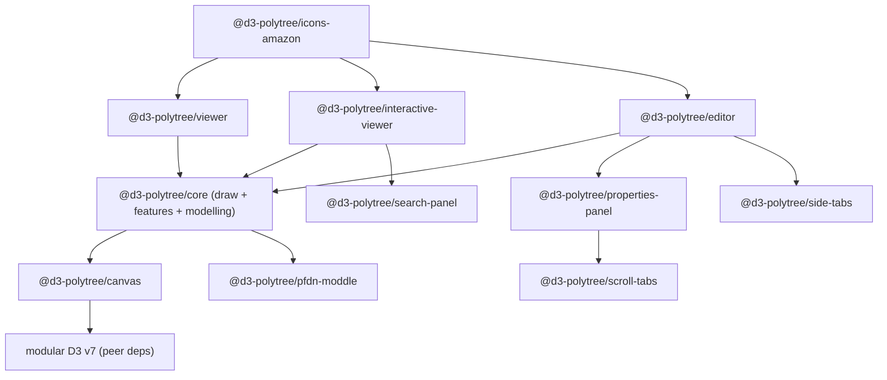

# d3-polytree — Modernization Roadmap

> **Status:** Proposal / RFC · **Owner:** @davcs86 · **Last updated:** 2026-09-14
> **Strategy:** Hybrid, phased-to-consolidation · **Language target:** TypeScript
> **Distribution:** monorepo → scoped npm packages · **D3:** slim, modular peer dependency
> **Dev/docs harness:** Storybook

This document is the single source of truth for modernizing the `d3-polytree` **ecosystem**. It
captures a full audit of the shipping code and the existing `v2.0-beta` prototype, inventories the
constellation of first-party repositories that make up v2, defines the target monorepo
architecture, and sequences the work into milestones with explicit exit criteria. It is
intentionally opinionated to minimize rework; decisions are recorded inline and in the decisions
log (§8), each tagged with the phase it unblocks.

---

## 1. Executive summary

`d3-polytree` renders interactive [polytree](https://en.wikipedia.org/wiki/Polytree) / process-flow
diagrams on top of D3. There are effectively **two codebases** today:

- **`master` (v1)** — a single ~839-LOC `SimpleNetwork` class on a **fully end-of-life stack**
  (D3 v3, Grunt/Browserify, JSHint, Bootstrap 3) with a browser-bundled Node XML parser that
  **requires hand-patching `node_modules` on every install**, a **latent Linux-only build break**,
  zero tests, and no CI. This is what npm/bower consumers get today.
- **`v2.0-beta` + companion repos** — a far more advanced, **diagram-js/bpmn-js-derived**
  rewrite: modular D3 (v1-era submodules), a `didi` dependency-injection kernel, a `moddle`-based
  model layer (`pfdn-moddle`) with an XML file format (`.pfdn`), a feature-module architecture
  (`lib/draw/*`, `lib/features/*`), and **three shipping components — Viewer, Interactive Viewer,
  and Editor**. Its logic is sound and modern *in shape*; only its **toolchain is frozen at mid-2017**
  (webpack 3, rollup 0.45, node-sass 4, ESLint 3/4) and it is **fragmented across eight
  repositories** wired together by `github:` dependencies.

The chosen direction is **hybrid, phased-to-consolidation**:

- **Track A — Stabilize `v1.x`:** make the *shipping* `master` code correct, buildable, and
  reproducible **without changing its public API**, so current consumers are unblocked.
- **Track B — Consolidate & modernize v2 into a monorepo:** unify the eight first-party repos into
  **one workspace** published as **scoped npm packages** (`@d3-polytree/*`), migrate the frozen
  toolchain to a modern one (Vite/tsup + pnpm + Turborepo + Changesets), convert to **TypeScript**,
  upgrade modular **D3 v1 → v7** as slim **peer** dependencies, retire the jQuery-era stack in the
  properties panel, and stand up **Storybook** as the development harness, visual-regression net,
  and published documentation site.

Track B is **consolidation, not a from-scratch rewrite** — the v2 architecture already exists and
is the asset being modernized. This materially lowers risk versus the greenfield framing.

---

## 2. Ecosystem inventory

Eight first-party repositories make up the v2 system (all companion repos last pushed 2017). The
monorepo's job is to absorb them.

| Repo | Role in v2 | Current stack / notable deps | Disposition |
|---|---|---|---|
| **`d3-polytree`** `@master` | v1 legacy viewer (shipping) | D3 v3, Grunt, JSHint | Maintain as `v1.x` (Track A); source of the v1 API contract |
| **`d3-polytree`** `@v2.0-beta` | v2 core: Viewer / InteractiveViewer / Editor, base canvas, `draw/*`, `features/*`, `modelling/*` | modular D3 v1, `didi`, `moddle`, `min-dom`, webpack 3, rollup 0.45 | Becomes `@d3-polytree/{core,viewer,interactive-viewer,editor}` |
| **`d3-canvas`** | Base SVG canvas toolbox: `Canvas`, `ElementRegistry`, `ElementBuilder`, `SvgExportingUtils` | modular D3 v1, `didi`, `eventemitter3`, `ids` | **Already vendored** into v2 `lib/base/core/*`; promote to `@d3-polytree/canvas` (single source of truth) |
| **`pfdn-moddle`** | PFDN model descriptor — read/write `.pfdn` diagram XML | `moddle`, `moddle-xml`; **has a mocha/chai test suite** | `@d3-polytree/pfdn-moddle` (keep as the file-format package) |
| **`d3-polytree-searchpanel`** | Search panel feature | `list.js`, `min-dom`, webpack 1 | `@d3-polytree/search-panel` |
| **`d3-polytree-sidetabs`** | Side-tabs UI feature | `min-dom`, `domify`, webpack 1 | `@d3-polytree/side-tabs` |
| **`d3-polytree-propertiespanel`** | Editor properties/editing panel | **`jquery` 1.11, `jquery-ui`, `slickgrid`, `spectrum-colorpicker`, `choices.js`, `scroll-tabs`** | `@d3-polytree/properties-panel` — **heaviest modernization liability** (see §7.5) |
| **`scroll-tabs`** (fork) | Tab-scrolling component used by properties-panel | `min-dom`, karma/phantomjs tests | Absorb into `properties-panel`, or publish as `@d3-polytree/scroll-tabs` |
| **`d3-polytree-amazon`** | AWS icon pack (~300 SVGs) + custom bundle example | depends on `d3-polytree#v2.0-beta` + `d3-canvas`, `svg-inline-loader` | `@d3-polytree/icons-amazon` — template for an **icon-pack package convention** |

### 2.1 First-party dependency graph (v2)



### 2.2 Architectural lineage

The v2 design is derived from the **bpmn.io / diagram-js** ecosystem (confirmed by @davcs86's forks
of `diagram-js`, `bpmn-js`, `bpmn-js-properties-panel`). The `didi` (DI) + `moddle` (model) +
`min-dom` + `ids` + `eventemitter3` stack, the feature-module pattern, and the palette/handlers
structure are all diagram-js idioms. **This is an advantage:** those patterns are well-proven, still
maintained upstream, and their modern TypeScript equivalents (current `diagram-js`, `didi`, `moddle`)
give us a migration reference and a supported dependency path.

---

## 3. Current-state audit

### 3.1 `master` (v1) — findings

Severity: **S1** = broken/insecure/blocks build · **S2** = major maintainability/architecture ·
**S3** = hygiene/DX.

| # | Sev | Finding | Evidence | Impact |
|---|-----|---------|----------|--------|
| F1 | **S1** | **Case-sensitivity build break.** Import casing ≠ file on disk. | `lib/SimpleNetwork.js:14` `require('./utils/lightBox')` vs file `lib/utils/lightbox.js` | Resolves on macOS/Windows but throws `MODULE_NOT_FOUND` on **Linux/CI/Docker**. *(verified)* |
| F2 | **S1** | **Non-reproducible build.** README requires hand-editing `node_modules/xml2js` after every install. | `README.md` "Known issue" | Build cannot run unattended; CI impossible without a manual patch. |
| F3 | **S1** | **Node XML parser shipped to the browser** solely to parse 8 lines of *static* SVG at runtime. | `SimpleNetwork.js:45,488-489` (`xml2js.Parser`/`parseString`) | Bundle bloat + Node polyfills; root cause of F2. *(verified)* |
| F4 | **S1** | **EOL core: D3 v3.5.16**, using APIs removed in D3 v4+. | `d3.behavior.*`, `d3.layout.force`, `d3.transform`, `d3.event.*`, `d3.rebind`, `.attr({})` object form | Cannot coexist with modern D3; blocks all downstream security patches. |
| F5 | **S2** | **Module-global mutable state** shared across instances. | `SimpleNetwork.js:46-47,494` (`processedIcons`) | Multiple instances on one page corrupt each other's icon registry. |
| F6 | **S2** | **XSS surface** via unsanitized HTML injection. | `SimpleNetwork.js:736-754` (`.html()` table); `lib/utils/lightbox.js` (`innerHTML`) | Untrusted labels/`attachedData`/lightbox content execute in the host page. |
| F7 | **S2** | **Dead toolchain** (Grunt/Browserify/uglify-js 2/JSHint); `new Buffer()` in `tasks/bundle.js:32`. | `package.json`, `GruntFile.js` | No ESM, no tree-shaking, no modern sourcemaps. |
| F8 | **S2** | **No tests, no CI** (`"test": "echo 0"`). | `package.json:7` | Every change unverified; the pure geometry engine is highly testable but untested. |
| F9 | **S2** | **Identity incoherence:** name `d3-simple-networks` vs bower `d3-polytree` vs dist `d3-simple-networks.js` vs global `D3SimpleNetwork`. | `package.json:2`, `bower.json:2` | Not installable under one canonical name. |
| F10 | **S2** | **Force-layout misuse:** a `d3.layout.force` sim is created then `force.stop()`-ed on tick; nodes are `fixed`. | `SimpleNetwork.js:599,610-613` | Pays physics-sim cost for a deterministic layered layout. |
| F11 | **S3** | **Heavy deps for trivial use:** full Bootstrap 3 (table CSS), `base-64`+`utf8` (native `btoa`/`TextEncoder` exist), `d3-tip` 0.6, `lodash` 4. | `package.json` deps | Oversized footprint; native APIs available. |
| F12 | **S3** | **Committed `dist/`** (30k-line bundle tracked in git). | `dist/*` | Noisy diffs, source/dist drift. |
| F13 | **S3** | **IE10/IE11 `marker-end` hack** runs every tick. | `SimpleNetwork.js:574-581` | Dead complexity. |
| F14 | **S3** | **No a11y** (no `role`/`aria`/`<title>`; mouse-only). | render code | Not screen-reader/keyboard accessible. |
| F15 | **S3** | **Distribution gaps:** no lockfile, no `exports`/`types`/`sideEffects`, bower primary, D3 a hard dep not peer. | root config | Poor DX, non-deterministic installs. |

### 3.2 `v2.0-beta` + companion repos — findings

| # | Sev | Finding | Impact |
|---|-----|---------|--------|
| G1 | **S2** | **Frozen 2017 toolchain** across all repos: webpack 1–3, rollup 0.45, node-sass 4, ESLint 3/4, uglify-js 2/3. | Won't build reliably on modern Node; no ESM/`exports`; slow, unmaintained loaders. |
| G2 | **S2** | **Fragmentation via `github:` deps.** Packages reference each other and unreleased forks (`d3-canvas`, `pfdn-moddle`, `scroll-tabs`, `pfdn-moddle`) by git URL, not semver. | No reproducible dependency resolution; a change ripples across repos by hand. Not published to npm. |
| G3 | **S2** | **`d3-canvas` duplicated.** Its `lib/core/*` is copy-vendored into v2 `lib/base/core/*`. | Two divergent copies of the base canvas; bug fixes must be applied twice. |
| G4 | **S2** | **jQuery-era properties panel.** `jquery` 1.11 + `jquery-ui` + `slickgrid` + `spectrum-colorpicker` + `choices.js`. | Largest bundle and biggest security/maintenance liability; several deps unmaintained. |
| G5 | **S2** | **Modular D3 at v1.** `d3-selection/zoom/drag/force/scale/dispatch/collection` pinned to 1.x. | Three majors behind v7; `d3-collection` is deprecated/removed in v7 (migrate to `Map`/`Set` + `d3-array`). |
| G6 | **S3** | **Runtime `xml2js` persists in v2** devDeps for icon parsing. | Same class of issue as F3; move icon parsing to build time. |
| G7 | **S3** | **Duplicated per-repo config** (`.eslintrc`, `postcss.config.js`, sass setup). | Drift; a monorepo collapses this to shared config. |
| G8 | **S3** | **No unit tests** except `pfdn-moddle` (mocha/chai) and `scroll-tabs` (karma). | Consolidation should carry `pfdn-moddle`'s tests forward and backfill the rest. |

### 3.3 What is worth preserving

- **The v2 architecture itself** — DI kernel, feature modules, model layer, three-component split.
  This is the core asset; modernization dresses it in a current toolchain and types.
- **`pfdn-moddle` + its test suite and the `.pfdn` file format** — the serialization contract.
- **The base canvas** (`d3-canvas` / `lib/base/core`) — de-duplicate into one package.
- **v1's pure geometry** (`helper.js` link routing, `calculateLevels`/`calculateNodes`) — port into
  `@d3-polytree/core` behind tests if v2 doesn't already supersede it.
- **The AWS icon pack** — as the template for an icon-pack package convention.

---

## 4. Guiding principles

1. **Correctness before modernity.** Ship the v1 case-fix + reproducible build (Track A) before
   Track B consolidation begins — a green baseline is a prerequisite for safe migration.
2. **One workspace, many packages.** All first-party code lives in a single monorepo; each unit
   ships as an independently versioned, semver'd npm package. No more `github:` cross-deps.
3. **Pure core, thin shell.** Model/geometry/layout are framework-free and unit-tested; D3/DOM is a
   rendering adapter at the edge — the fault-isolation boundary that contains the D3 v1→v7 upgrade.
4. **D3 as slim peer dependencies.** Depend only on the submodules actually used, declared **peer**,
   so consumers control the D3 version and dedupe a single copy.
5. **Types are the contract.** Author in strict TypeScript; ship `.d.ts` for every package.
6. **Storybook is the harness.** Every visual package has stories; Storybook is dev environment,
   visual-regression baseline, and the public docs/demo site (retiring hand-built `docs/*.html`,
   JSFiddle, and CodePen).
7. **Security & a11y by default.** No `innerHTML` with unsanitized input; retire jQuery-era deps;
   add ARIA/keyboard support.
8. **Reproducible everywhere.** Committed lockfile; install → build → test → storybook → publish all
   run in CI from a clean checkout with zero manual steps.

---

## 5. Target architecture (v2 monorepo)

```
d3-polytree/                      # monorepo root (pnpm workspace + Turborepo)
  package.json                    # workspaces, shared scripts
  pnpm-workspace.yaml
  turbo.json                      # task graph / caching
  tsconfig.base.json              # shared strict TS config
  eslint.config.js                # shared flat ESLint config (replaces per-repo .eslintrc)
  .changeset/                     # Changesets versioning
  packages/
    canvas/                       # @d3-polytree/canvas   (ex d3-canvas + v2 lib/base/core, de-duped)
    pfdn-moddle/                  # @d3-polytree/pfdn-moddle (moddle model + .pfdn XML I/O + tests)
    core/                         # @d3-polytree/core     (draw/* + features/* + modelling/*, DI wiring)
    viewer/                       # @d3-polytree/viewer
    interactive-viewer/           # @d3-polytree/interactive-viewer
    editor/                       # @d3-polytree/editor
    search-panel/                 # @d3-polytree/search-panel   (retire list.js or replace)
    side-tabs/                    # @d3-polytree/side-tabs
    properties-panel/             # @d3-polytree/properties-panel (de-jQuery; absorbs scroll-tabs)
    icons-amazon/                 # @d3-polytree/icons-amazon   (icon-pack convention)
  apps/
    storybook/                    # dev harness + visual-regression + published docs site
    playground/                   # optional standalone example app
```

**Key architectural changes vs the frozen v2.0-beta**

- **De-duplicate the base canvas** — one `@d3-polytree/canvas`; delete the vendored copy (fixes G3).
- **Build-time icons** — resolve SVG via the bundler (`?raw`/inline) into typed `<symbol>` maps;
  drop runtime `xml2js` (fixes G6/F3).
- **Modular D3 v7 peer deps** — replace v1 submodules; migrate `d3-collection` → native `Map`/`Set`
  + `d3-array` (fixes G5).
- **Instance-scoped state** — no module-global registries (fixes F5-class issues).
- **Text is text** — DOM/`textContent` construction, no unsanitized HTML (fixes F6).
- **De-jQuery the properties panel** — replace jQuery-UI/slickgrid/spectrum/choices with modern,
  framework-free equivalents (see §7.5) (fixes G4).

---

## 6. Roadmap — phases & milestones

Effort estimates are order-of-magnitude for one experienced maintainer and are **relative**, not
calendar commitments (S < M < L < XL).

### Track A — Stabilize v1.x (blocking; do first)

> Goal: a correct, reproducible, CI-verified `v1.1.0` current consumers can rely on, **no API change**.

| Phase | Deliverable | Exit criteria | Effort |
|---|---|---|---|
| **A0 — Baseline** | Green checkout | `npm ci` works on Linux; smoke demo documents current behavior | S |
| **A1 — Critical fixes** | `v1.1.0` | **F1** casing fixed; **F2/F3** runtime `xml2js` removed (icons pre-parsed at build); unattended build | M |
| **A2 — Security patch** | `v1.1.1` | **F6** `.html()`/lightbox injection replaced with safe DOM/text | S |
| **A3 — Reproducibility** | committed lockfile; `dist/` out of VCS (built by CI) | Clean-room build reproduces; **F12** resolved | S |
| **A4 — CI + smoke tests** | GitHub Actions | lint + build + minimal render smoke test on every PR (**F8** partial) | M |
| **A5 — Identity** | canonical name | **F9** resolved across manifests/dist/global/README; deprecate bower; publish to npm | S |

**Track A explicitly does NOT** upgrade D3, convert to TS, or change the API — those are Track B.

### Track B — Consolidate & modernize the v2 monorepo (parallel after A ships)

| Phase | Deliverable | Exit criteria | Effort |
|---|---|---|---|
| **B0 — Monorepo scaffold** | pnpm + Turborepo workspace | Empty-but-wired workspace: shared `tsconfig.base`, flat ESLint, Prettier, Vitest, Changesets, Turbo task graph; CI green on an empty build | M |
| **B1 — Absorb repos (history-preserving)** | 8 repos → `packages/*` | Each repo imported via `git subtree`/`git filter-repo` **preserving history**; `github:` cross-deps replaced with `workspace:*`; builds still pass on old toolchain in-place | M |
| **B2 — De-duplicate & model** | `@d3-polytree/canvas`, `@d3-polytree/pfdn-moddle` | Vendored `lib/base/core` deleted in favor of `canvas` (**G3**); `pfdn-moddle` tests run green in the workspace (**G8**) | M |
| **B3 — Toolchain migration** | modern build per package | Vite/tsup lib mode → ESM+CJS+`.d.ts`, `exports`/`types`/`sideEffects` maps; node-sass→dart-sass/PostCSS; drop webpack 1–3/rollup 0.45/uglify (**G1, F7, F15**); build-time icons (**G6**) | L |
| **B4 — TypeScript migration** | typed packages | Incremental JS→TS (allowJs bridge) starting at `canvas`/`core`; strict mode; public `.d.ts` for every package; typed options API | L |
| **B5 — D3 v7 + native collections** | modern D3 | Modular D3 v1→v7 as **peer deps**; `d3-collection`→`Map`/`Set`+`d3-array` (**G5**); interaction parity verified via Storybook visual tests | L |
| **B6 — De-jQuery properties panel** | modern `properties-panel` | Replace jquery-ui/slickgrid/spectrum/choices/scroll-tabs (**G4**, §7.5); absorb `scroll-tabs`; feature-parity checklist vs 2017 panel | XL |
| **B7 — Storybook** | dev/docs harness | Stories for viewer, interactive-viewer, editor, search-panel, side-tabs, properties-panel, icon packs; visual-regression wired (**§7.1**) | M |
| **B8 — a11y + theming** | accessible, themeable | SVG `role`/`<title>`/`<desc>`, keyboard nav/focus; CSS custom properties; drop normalize/Bootstrap remnants (**F14, F11**) | M |
| **B9 — Release** | `@d3-polytree/*` on npm | Changesets-driven versioning/changelog/publish with provenance; migration guide (v1→v2 and beta→v2); Storybook deployed as docs site; JSFiddle/CodePen replaced | M |

### 6.1 Dependency graph (what blocks what)

```
A0 → A1 → A2 → A4 → A5        (A3 parallel)
A1 (reproducible build) ─────────────┐
                                     ▼
B0 → B1 → B2 → B3 → B4 → B5 → B7 → B8 → B9
                    └────→ B6 ────────┘   (B6 can run parallel after B4; gates B9)
```

---

## 7. Cross-cutting workstreams

### 7.1 Storybook (dev harness · visual regression · docs)
- **Renderer:** `@storybook/html-vite` (the components are framework-free vanilla SVG/DOM;
  no React). Reassess only if a component is reimplemented in a framework.
- **Stories per package:** each visual package exposes stories driving its public API with controls
  (args) for options — doubles as living documentation of the typed options.
- **Visual regression:** Storybook test-runner + Playwright snapshots in CI (or Chromatic if a
  hosted service is preferred) — this is the primary safety net for the D3 v1→v7 migration (B5).
- **Docs site:** Storybook static build deployed (GitHub Pages) as the canonical demo/docs,
  retiring `docs/*.html`, JSFiddle, and CodePen.

### 7.2 Testing strategy
- **Unit (Vitest):** model (`pfdn-moddle` — carry existing mocha specs over or port to Vitest),
  geometry/layout, DI wiring. Pure modules first — highest ROI.
- **Characterization tests:** snapshot v1/beta layout coordinates and generated path `d` strings for
  fixture diagrams; assert parity within tolerance after each migration step.
- **Component/DOM:** enter/update/exit, drag/zoom/selection interactions (jsdom or Playwright CT).
- **Visual regression:** via Storybook (§7.1).

### 7.3 Monorepo tooling & CI
- **Package manager:** pnpm workspaces (strict, fast, `workspace:*` protocol).
- **Task runner:** Turborepo (cached `build`/`test`/`lint`/`storybook` task graph).
- **Versioning/release:** Changesets → per-package semver, changelogs, `npm publish --provenance`.
- **Shared config:** one `tsconfig.base.json`, one flat `eslint.config.js`, one Prettier config
  (collapses G7); `.editorconfig`, `.nvmrc`/`engines`, committed `pnpm-lock.yaml`.
- **CI (GitHub Actions):** `install → typecheck → lint → test → build → storybook build → visual
  regression` on PR; release workflow on tag.

### 7.4 Distribution & versioning
- **Scope:** publish under `@d3-polytree/*` (recommended) — reserves an npm org and namespaces the
  ecosystem. See O2.
- **Package fields:** `"type": "module"`, `exports` (import/require/types), `"sideEffects"` (CSS
  listed), `"peerDependencies"` for D3 submodules, `"files"` allowlist.
- **Semver:** v1.x = fixes only; `@d3-polytree/*` v2.0 = the modernized line; document a v1 support
  window. Retire Bower everywhere.

### 7.5 De-jQuery migration (properties-panel, B6)
The 2017 properties panel is the single largest liability. Proposed replacements (framework-free):

| Legacy dep | Purpose | Modern replacement (candidate) |
|---|---|---|
| `jquery` / `jquery-ui` | DOM + widgets | native DOM + small typed helpers (`min-dom` successor) |
| `slickgrid` | data grid (spreadsheet entries) | headless grid (e.g. a lightweight virtualized grid) or a purpose-built typed table |
| `spectrum-colorpicker` | color picker | native `<input type="color">` or a small vanilla picker |
| `choices.js` | select/autocomplete | native `<select>` + a small combobox, or a maintained vanilla lib |
| `scroll-tabs` | scrollable tab strip | absorb + reimplement with `ResizeObserver`/`scrollIntoView` |

Each replacement is gated by a Storybook story and a feature-parity check against the 2017 panel.

### 7.6 Documentation
- Per-package READMEs + typed options reference (surfaced via Storybook docs).
- Two migration guides: **v1 → v2** and **v2.0-beta → v2** (github-dep → npm, D3 v1 → v7).
- Storybook docs site replaces ad-hoc demos.

---

## 8. Decisions log

Foundational choices confirmed for this revision: **hybrid, phased-to-consolidation** strategy,
**monorepo**, **include companion repos**, **npm distribution**, **Storybook**, **TypeScript**,
**slim modular D3 peer deps**.

All originally-open questions (O1–O9) are now decided (@davcs86, 2026-09-14). No open questions
remain; new ones should be appended below as they arise.

| ID | Question | Decision | Blocks |
|---|---|---|---|
| O1 | v2 model layer — keep `.pfdn`/`moddle` XML, or move to JSON? | **Keep `pfdn-moddle`** (proven, tested); a JSON import/export adapter may be added later, not a replacement. | B2, B4 |
| O2 | npm scope — scoped vs unscoped? | **`@d3-polytree/*` (scoped).** | B9 |
| O3 | Storybook renderer? | **`@storybook/html-vite`** (components are framework-free DOM/SVG today). | B7 |
| O4 | `scroll-tabs` — publish or absorb? | **Absorb** into `@d3-polytree/properties-panel` (single consumer); no standalone package. | B6 |
| O5 | Layout-parity bar? | **Tolerance-based**, enforced by numeric characterization tests + Storybook visual regression (byte-for-byte is not a goal). | B4, B5 |
| O6 | History preservation when absorbing repos? | **`git filter-repo`** into per-package subdirectories (preserve authorship/history). | B1 |
| O7 | Minimum browser matrix? | **Evergreen + last 2 versions; drop IE** (retire F13 + `classlist-polyfill`). | B5, B8 |
| O8 | Bundled-D3 UMD/IIFE build alongside the ESM peer-dep builds? | **Yes** — a secondary artifact for the three top-level components (`viewer`, `interactive-viewer`, `editor`) only; the peer-dep ESM build stays primary. | B3, B9 |
| O9 | Properties-panel grid replacement (replaces `slickgrid`)? | **Decide via a Storybook spike in B6** — prototype a headless grid (e.g. TanStack Table core) vs a purpose-built typed table, choose on measured bundle-size vs feature fit. This is the one deferred-to-spike decision. | B6 |

---

## 9. Risk register

| Risk | Likelihood | Impact | Mitigation |
|---|---|---|---|
| D3 v1→v7 migration introduces interaction regressions | High | High | Storybook visual regression + characterization tests gate B5; migrate interaction-by-interaction |
| Properties-panel de-jQuery (B6) balloons in scope | High | High | Ship viewer + interactive-viewer first (`v2.0.0`); editor/properties-panel can follow as `v2.1` |
| History loss when absorbing 8 repos | Medium | Medium | `git filter-repo` into per-package subdirs (decided, O6); verify blame/authorship post-import |
| `github:` → `workspace:*` breakage during B1 | Medium | Medium | Absorb first, keep old toolchain building in-place, then migrate toolchain (B3) separately |
| Divergence between `d3-canvas` and its vendored copy hides bugs | Medium | Medium | De-duplicate early (B2) before any refactor touches the base |
| Consumers depend on v1 global/options shape | Medium | Medium | Track A keeps v1 supported; v1→v2 migration guide (B9/7.6) |
| Peer-dep D3 version friction | Medium | Low | Ship bundled UMD variant (O8); document supported D3 range |
| "Track A only" — v2 consolidation never starts | Medium | Medium | "No new features on v1"; all feature demand routes to the v2 backlog |

---

## 10. Immediate next actions (first PRs)

1. **Fix F1** (import casing) — one-line change; unblocks Linux/CI. *(A1)*
2. **Remove runtime `xml2js`** on `master` — pre-parse icons at build; delete the README manual-patch
   step. *(A1 / F2 / F3)*
3. **Add GitHub Actions** on `master` — `install → build` on Linux to prevent F1-class regressions. *(A4)*
4. **Commit lockfile; gitignore `dist/`.** *(A3 / F12)*
5. **Stand up the monorepo skeleton** on a `v2` branch under the `@d3-polytree/*` scope (O2): pnpm +
   Turborepo + Changesets + shared TS/ESLint/Vitest/Storybook scaffolding — no code moved yet. *(B0)*
6. **Absorb the 8 repos with `git filter-repo`** (O6) into `packages/*` subdirectories, preserving
   authorship/history, then swap `github:` cross-deps for `workspace:*`. *(B1)*

Each is small, independently reviewable, and moves the ecosystem toward a green baseline before the
consolidation phases begin.

---

## Appendix A — Repo → package disposition

| Source repo | Target package | Notes |
|---|---|---|
| `d3-polytree@master` | *(stays)* `d3-polytree` v1.x | Maintenance-only; API contract source |
| `d3-polytree@v2.0-beta` `lib/base/core` | `@d3-polytree/canvas` | De-dup with `d3-canvas` |
| `d3-polytree@v2.0-beta` `lib/draw` + `lib/features` + `lib/modelling` | `@d3-polytree/core` | DI-wired feature modules |
| `d3-polytree@v2.0-beta` `lib/Viewer.js` | `@d3-polytree/viewer` | |
| `d3-polytree@v2.0-beta` `lib/InteractiveViewer.js` | `@d3-polytree/interactive-viewer` | + search-panel |
| `d3-polytree@v2.0-beta` `lib/Editor.js` | `@d3-polytree/editor` | + properties-panel + side-tabs |
| `d3-canvas` | `@d3-polytree/canvas` | Single source of truth for the base |
| `pfdn-moddle` | `@d3-polytree/pfdn-moddle` | Keep tests; `.pfdn` format |
| `d3-polytree-searchpanel` | `@d3-polytree/search-panel` | Reassess `list.js` |
| `d3-polytree-sidetabs` | `@d3-polytree/side-tabs` | |
| `d3-polytree-propertiespanel` | `@d3-polytree/properties-panel` | De-jQuery (B6) |
| `scroll-tabs` | absorbed into `@d3-polytree/properties-panel` | Decided (O4): absorbed, no standalone package |
| `d3-polytree-amazon` | `@d3-polytree/icons-amazon` | Icon-pack convention template |

## Appendix B — v1 file-by-file disposition (Track A)

| File | Track A action |
|---|---|
| `lib/SimpleNetwork.js` | fix F1/F5/F6 in place |
| `lib/utils/helper.js` | keep (add tests if cheap) — geometry may be ported to `@d3-polytree/core` |
| `lib/utils/dblClick.js` | keep |
| `lib/utils/lightbox.js` | fix F6 (safe DOM) |
| `lib/icons/*` | pre-parse at build (kills runtime `xml2js`) |
| `tasks/*`, `GruntFile.js` | keep minimal for v1.x |
| `bower.json`, `.jshintrc` | keep for v1.x; deleted in v2 |
| `dist/*` | remove from VCS; produced by CI |
